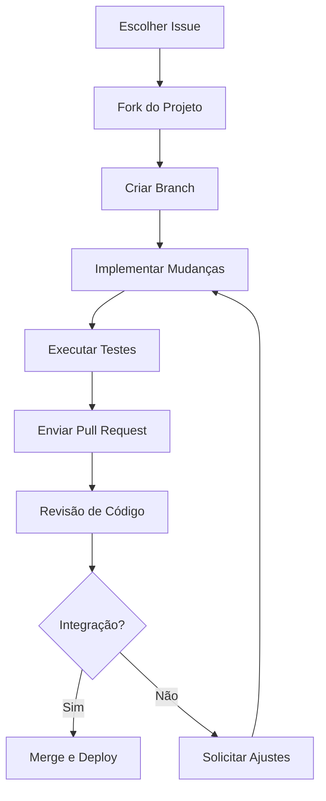

# 🤝 Como Contribuir - AlphaClinic QMS

## Visão Geral

Acreditamos que o desenvolvimento colaborativo é essencial para criar as melhores soluções. Sua contribuição é muito bem-vinda! Este guia explica como você pode contribuir para o AlphaClinic QMS, seja reportando bugs, sugerindo melhorias, escrevendo documentação ou desenvolvendo código.

## 🌟 Por que Contribuir?

### Benefícios para Você
- 🎓 **Aprendizado**: Desenvolva habilidades técnicas e de gestão de qualidade
- 👥 **Networking**: Conecte-se com profissionais da área de saúde e tecnologia
- 💼 **Portfólio**: Adicione projetos relevantes ao seu portfólio
- 🏆 **Reconhecimento**: Seja reconhecido pela comunidade e equipe AlphaClinic
- 🚀 **Carreira**: Oportunidades de carreira e crescimento profissional

### Benefícios para o Projeto
- 🔧 **Melhorias**: Funcionalidades solicitadas pela comunidade
- 🐛 **Correções**: Identificação e correção de bugs
- 📚 **Documentação**: Documentação mais clara e completa
- 🌍 **Diversidade**: Perspectivas variadas enriquecem o produto
- 🚀 **Inovação**: Ideias criativas impulsionam evolução

## 📋 Tipos de Contribuição

### 1. Reportar Bugs
Encontrou um problema? Ajude-nos a melhorar!

#### Como Reportar
```markdown
## Descrição do Bug
Descrição clara e concisa do problema encontrado.

## Passos para Reproduzir
1. Passo 1: Acesse a página X
2. Passo 2: Clique no botão Y
3. Passo 3: Observe o comportamento incorreto

## Comportamento Esperado
O que deveria acontecer normalmente.

## Comportamento Atual
O que está acontecendo de errado.

## Ambiente
- Sistema Operacional: Windows 10
- Navegador: Chrome 120.0
- Versão do QMS: 1.0.0
- Plano: Professional

## Capturas de Tela
[Anexe imagens se necessário]

## Logs de Erro
[Cole logs relevantes aqui]
```

### 2. Sugerir Melhorias
Tem ideias para tornar o sistema melhor?

#### Template para Sugestões
```markdown
## Título da Sugestão
Nome claro e descritivo da melhoria proposta.

## Descrição Detalhada
Explique em detalhes o que você gostaria de ver implementado.

## Problema que Resolve
Que problema específico essa melhoria resolve?

## Benefícios Esperados
- Benefício 1: Descrição
- Benefício 2: Descrição
- Benefício 3: Descrição

## Exemplo de Uso
Como a funcionalidade seria usada na prática.

## Alternativas Consideradas
Outras soluções que você considerou e por que esta é melhor.

## Critérios de Aceitação
Como saber se a implementação foi bem-sucedida.
```

### 3. Contribuir com Código
Desenvolvedor interessado em contribuir com código?

#### Processo de Contribuição


#### Diretrizes para Código
```python
# 1. Siga os padrões estabelecidos
def new_feature():
    """Implementação seguindo padrões do projeto"""
    pass

# 2. Escreva testes adequados
def test_new_feature():
    """Teste para validar funcionalidade"""
    assert True  # Implementação adequada

# 3. Documente adequadamente
def documented_function():
    """
    Função bem documentada.

    Args:
        param: Descrição do parâmetro

    Returns:
        Tipo de retorno e descrição
    """
    pass
```

### 4. Melhorar Documentação
A documentação nunca é boa o suficiente!

#### Áreas que Precisam de Ajuda
- 📖 **Tutoriais**: Guias passo-a-passo para usuários
- 🔧 **Guias Técnicos**: Documentação para desenvolvedores
- 🎥 **Vídeos**: Tutoriais em vídeo
- 🌍 **Traduções**: Tradução para outros idiomas
- 📚 **Exemplos**: Casos de uso práticos

## 🛠️ Ambiente de Desenvolvimento

### Pré-requisitos

#### Software Necessário
- **Python**: 3.8 ou superior
- **PostgreSQL**: 12 ou superior
- **Redis**: 6 ou superior
- **Git**: 2.20 ou superior
- **Node.js**: 16+ (para assets)
- **Docker**: (opcional, para ambiente isolado)

#### Configuração Inicial
```bash
# 1. Clone o repositório
git clone https://github.com/alphaclin/qms.git
cd qms

# 2. Configure ambiente virtual
python -m venv venv
source venv/bin/activate  # Linux/macOS
# ou
venv\Scripts\activate     # Windows

# 3. Instale dependências
pip install -r requirements.txt
pip install -r requirements-dev.txt

# 4. Configure variáveis de ambiente
cp .env.example .env
# Edite .env com suas configurações

# 5. Execute migrações
flask db upgrade

# 6. Execute testes
pytest tests/ -v
```

### Estrutura do Projeto
```
alphaclin-qms/
├── app/                    # Código principal da aplicação
│   ├── models.py          # Modelos de dados
│   ├── services/          # Lógica de negócio
│   ├── blueprints/        # Módulos da aplicação
│   └── utils/             # Utilitários
├── tests/                 # Testes automatizados
├── docs/                  # Documentação
├── scripts/               # Scripts utilitários
└── docker/                # Configurações Docker
```

## 📋 Diretrizes para Contribuidores

### Padrões de Código

#### Convenções Python
```python
# Imports organizados
import os
import sys
from datetime import datetime
from typing import List, Dict, Optional

# Imports de terceiros
from flask import Flask, request
from sqlalchemy import Column, Integer, String

# Imports locais
from app.models import User, Document
from app.services import DocumentService

# Constantes em maiúsculo
MAX_FILE_SIZE = 16777216
SUPPORTED_FORMATS = ['pdf', 'doc', 'docx']

# Funções claras e documentadas
def process_document(document_id: int) -> bool:
    """
    Processa documento específico.

    Args:
        document_id: ID único do documento

    Returns:
        True se processamento foi bem-sucedido
    """
    pass
```

#### Estilo de Commits
```bash
# Commits claros e descritivos
git commit -m "feat: adicionar funcionalidade de assinatura digital"

# Tipos de commit
# feat: nova funcionalidade
# fix: correção de bug
# docs: alteração na documentação
# style: formatação de código
# refactor: refatoração de código
# test: adicionar ou modificar testes
# chore: tarefas de manutenção
```

### Testes Obrigatórios

#### Cobertura de Testes
- ✅ **Testes unitários**: Para todas as funções públicas
- ✅ **Testes de integração**: Para fluxos completos
- ✅ **Testes de API**: Para todos os endpoints
- ✅ **Testes de segurança**: Para validações de segurança
- ✅ **Testes de performance**: Para funcionalidades críticas

#### Exemplo de Teste
```python
import pytest
from app.models import Document

class TestDocumentCreation:
    """Testes para criação de documentos"""

    def test_create_valid_document(self):
        """Testa criação de documento válido"""
        document = Document(
            code='PROC-001',
            title='Test Document',
            author_id=1
        )

        assert document.code == 'PROC-001'
        assert document.status == 'draft'

    def test_create_document_without_code(self):
        """Testa criação sem código (deve falhar)"""
        with pytest.raises(ValueError):
            Document(title='Test Document', author_id=1)
```

## 🌟 Programa de Reconhecimento

### Níveis de Contribuição

#### 1. Contribuidor Inicial
- 📝 **Critérios**: Primeira contribuição aceita
- 🏆 **Reconhecimento**: Badge no GitHub
- 📚 **Acesso**: Fórum exclusivo de contribuidores

#### 2. Contribuidor Ativo
- 📝 **Critérios**: 5+ contribuições aceitas
- 🏆 **Reconhecimento**: Nome no hall de contribuidores
- 🎓 **Acesso**: Acesso beta a novas funcionalidades

#### 3. Mantenedor
- 📝 **Critérios**: 20+ contribuições de alta qualidade
- 🏆 **Reconhecimento**: Certificado de mantenedor
- 🔧 **Acesso**: Acesso direto ao repositório principal

#### 4. Especialista
- 📝 **Critérios**: Expertise reconhecida em área específica
- 🏆 **Reconhecimento**: Título de especialista
- 👥 **Acesso**: Participação em decisões técnicas

### Recompensas

#### Reconhecimento Público
- 🏆 **Hall da Fama**: Página dedicada a contribuidores
- 📜 **Certificados**: Certificados digitais de contribuição
- 🎓 **Eventos**: Convites para eventos exclusivos
- 💼 **Oportunidades**: Possibilidade de oportunidades profissionais

#### Benefícios Tangíveis
- 🎁 **Merchandise**: Camisetas, canecas e outros brindes
- 📚 **Livros Técnicos**: Livros sobre desenvolvimento e qualidade
- 🎓 **Cursos**: Acesso gratuito a cursos especializados
- 💰 **Programa de Referral**: Comissão por indicações bem-sucedidas

## 📋 Processo de Contribuição

### 1. Preparação

#### Escolha uma Issue
1. **Explore Issues**: Veja issues abertas em https://github.com/alphaclin/qms/issues
2. **Escolha Adequada**: Selecione issue compatível com seu nível e interesse
3. **Comentários**: Comente na issue demonstrando interesse
4. **Atribuição**: Aguarde atribuição da issue

#### Ambiente de Desenvolvimento
1. **Fork**: Faça fork do repositório
2. **Clone**: Clone seu fork localmente
3. **Configure**: Configure ambiente conforme guia
4. **Teste**: Execute testes existentes

### 2. Desenvolvimento

#### Implementação
1. **Criar Branch**: `git checkout -b feature/nova-funcionalidade`
2. **Desenvolver**: Implemente a funcionalidade
3. **Testar**: Escreva e execute testes
4. **Documentar**: Atualize documentação se necessário
5. **Commit**: Faça commits claros e frequentes

#### Validação
1. **Testes Locais**: Execute todos os testes
2. **Linting**: Verifique estilo de código
3. **Cobertura**: Mantenha cobertura adequada
4. **Performance**: Teste performance se aplicável

### 3. Submissão

#### Pull Request
1. **Push**: Envie branch para seu fork
2. **PR**: Abra Pull Request contra branch develop
3. **Descrição**: Descreva claramente as mudanças
4. **Referência**: Referencie issue relacionada
5. **Revisão**: Aguarde revisão da equipe

#### Revisão de Código
1. **Feedback**: Responda feedback dos revisores
2. **Ajustes**: Implemente ajustes solicitados
3. **Aprovação**: Aguarde aprovação final
4. **Merge**: Pull Request será integrado

## 📚 Recursos para Contribuidores

### Documentação Técnica

#### Guias Disponíveis
- 📖 **Guia de Desenvolvimento**: Padrões e práticas
- 🧪 **Guia de Testes**: Como escrever testes eficazes
- 🔒 **Guia de Segurança**: Práticas de segurança
- 📊 **Guia de Performance**: Otimização de performance
- 🌍 **Guia de Internacionalização**: Suporte a múltiplos idiomas

#### Exemplos de Código
```python
# Diretório: examples/
examples/
├── basic_usage.py          # Uso básico do sistema
├── custom_integration.py   # Integração personalizada
├── api_client.py          # Cliente de API
├── mobile_app.js          # Aplicativo mobile
└── data_analysis.py       # Análise de dados
```

### Ferramentas de Desenvolvimento

#### Ambiente Docker
```bash
# Desenvolvimento com Docker
docker-compose -f docker-compose.dev.yml up

# Executar testes em container
docker-compose -f docker-compose.test.yml run --rm test

# Ambiente de produção simulado
docker-compose -f docker-compose.staging.yml up
```

#### Scripts Úteis
```bash
# Scripts disponíveis em scripts/
scripts/
├── setup_dev.sh           # Configuração inicial
├── run_tests.sh          # Execução de testes
├── check_coverage.sh     # Verificação de cobertura
├── format_code.sh        # Formatação automática
└── deploy_demo.sh        # Deploy de demonstração
```

## 🤝 Código de Conduta

### Princípios Gerais

#### Respeito e Inclusão
- ✅ **Respeito**: Trate todos com respeito e profissionalismo
- ✅ **Inclusão**: Seja inclusivo e acolhedor
- ✅ **Diversidade**: Valorize diversidade de opiniões e backgrounds
- ✅ **Colaboração**: Foque em colaboração construtiva

#### Comunicação
- ✅ **Clareza**: Comunique ideias de forma clara
- ✅ **Respeito**: Mantenha tom respeitoso em discussões
- ✅ **Construtividade**: Foque em soluções, não problemas
- ✅ **Feedback**: Dê e receba feedback de forma construtiva

### Regras Específicas

#### Proibições
- ❌ **Discurso de ódio**: Qualquer forma de discriminação
- ❌ **Assédio**: Comportamento assediante ou intimidatório
- ❌ **Spam**: Mensagens repetitivas ou fora de contexto
- ❌ **Trolling**: Provocação deliberada de conflitos

#### Consequências
- ⚠️ **Advertência**: Para primeira infração leve
- 🚫 **Suspensão Temporária**: Para infrações moderadas
- ❌ **Ban Permanente**: Para infrações graves ou repetidas

## 📞 Suporte para Contribuidores

### Canais de Comunicação

#### Comunidade
- 💬 **Discord**: Servidor dedicado para contribuidores
- 💬 **Slack**: Canal #contributors
- 📧 **Email**: contributors@alphaclin.com
- 🐛 **GitHub Issues**: Para questões técnicas específicas

#### Mentoria
- 👥 **Programa de Mentoria**: Mentoria para novos contribuidores
- 🎓 **Revisores Designados**: Revisores experientes para cada PR
- 📚 **Sessões de Código**: Revisões de código em grupo
- 🎥 **Webinars Técnicos**: Sessões educativas mensais

### Recursos Educacionais

#### Cursos e Tutoriais
- 🎓 **Curso de Git**: Para iniciantes em controle de versão
- 🧪 **Curso de Testes**: Aprenda a escrever testes eficazes
- 🐍 **Curso de Python**: Para quem quer aprender Python
- 📚 **Curso de QMS**: Conceitos de gestão da qualidade

#### Documentação
- 📖 **Guia do Contribuidor**: Este documento completo
- 🔧 **Referência de API**: Documentação técnica detalhada
- 🏗️ **Arquitetura**: Entendimento da arquitetura do sistema
- 🧪 **Padrões de Teste**: Como escrever testes seguindo padrões

## 🎯 Projetos para Iniciantes

### Issues "Boas para Iniciantes"

#### Exemplos de Primeiras Contribuições
1. **Correções de Bug Simples**
   - Erros de digitação em mensagens
   - Links quebrados na documentação
   - Pequenos ajustes de interface

2. **Melhorias de Documentação**
   - Adicionar exemplos de código
   - Melhorar explicações técnicas
   - Traduzir documentação

3. **Testes Adicionais**
   - Testes para funcionalidades existentes
   - Casos de teste de borda
   - Melhorar cobertura de testes

4. **Funcionalidades Menores**
   - Filtros adicionais em listas
   - Validações de entrada
   - Melhorias de usabilidade

### Processo para Iniciantes

#### Passo a Passo
1. **Explore Issues**: Veja issues marcadas como "good first issue"
2. **Escolha Uma**: Selecione issue que te interessa
3. **Pesquise**: Entenda o contexto e código relacionado
4. **Implemente**: Faça as mudanças necessárias
5. **Teste**: Verifique se funciona corretamente
6. **Submeta**: Abra Pull Request
7. **Aprenda**: Receba feedback e melhore

## 🌟 Contribuidores Destacados

### Hall da Fama

#### Top Contribuidores 2024
```javascript
const topContributors = [
  {
    "name": "Ana Silva",
    "contributions": 45,
    "area": "Frontend",
    "highlight": "Implementação do tema dark"
  },
  {
    "name": "Carlos Santos",
    "contributions": 38,
    "area": "Backend",
    "highlight": "Otimização de performance de APIs"
  },
  {
    "name": "Marina Costa",
    "contributions": 32,
    "area": "Documentação",
    "highlight": "Guia completo de instalação"
  }
];
```

### Reconhecimento Mensal

#### Contribuidor do Mês
- 🏆 **Seleção**: Baseada em qualidade e impacto das contribuições
- 🎁 **Prêmios**: Livros técnicos, cursos online, merchandise
- 📢 **Destaque**: Anúncio nas redes sociais e newsletter

## 📈 Métricas de Contribuição

### Acompanhamento de Progresso

#### Métricas Individuais
```javascript
const contributorMetrics = {
  "contributions": {
    "total_prs": 15,
    "accepted_prs": 13,
    "issues_opened": 8,
    "issues_closed": 12,
    "documentation_edits": 25
  },
  "impact": {
    "lines_of_code": 1250,
    "tests_added": 45,
    "bugs_fixed": 8,
    "features_implemented": 3
  },
  "engagement": {
    "comments_participation": 67,
    "review_participation": 23,
    "community_help": 12
  }
};
```

## 🎓 Programa de Desenvolvimento

### Caminhos de Crescimento

#### Desenvolvedor Frontend
1. **Iniciante**: Correções de CSS e pequenas funcionalidades
2. **Intermediário**: Desenvolvimento de componentes React
3. **Avançado**: Arquitetura de frontend e performance
4. **Especialista**: Liderança técnica e mentoria

#### Desenvolvedor Backend
1. **Iniciante**: Correções de bugs e pequenas APIs
2. **Intermediário**: Desenvolvimento de serviços Python
3. **Avançado**: Arquitetura de sistemas e banco de dados
4. **Especialista**: Escalabilidade e sistemas distribuídos

#### Especialista em Qualidade
1. **Iniciante**: Testes básicos e validações
2. **Intermediário**: Estratégias de teste e automação
3. **Avançado**: Gestão de qualidade e processos
4. **Especialista**: Liderança em qualidade de software

## 📋 Perguntas Frequentes

### Sobre Contribuição

#### Q: Preciso ser especialista para contribuir?
**A: Não!** Contribuidores de todos os níveis são bem-vindos. Temos issues marcadas especificamente para iniciantes.

#### Q: Quanto tempo preciso dedicar?
**A: O quanto quiser!** Desde pequenas correções até projetos maiores, toda contribuição é valiosa.

#### Q: Como sei se minha contribuição será aceita?
**A: Siga os padrões!** Contribuições que seguem nossos padrões e resolvem problemas reais têm alta chance de aceitação.

### Sobre Código

#### Q: Posso modificar funcionalidades existentes?
**A: Sim!** Melhorias em funcionalidades existentes são muito bem-vindas, especialmente se acompanhadas de testes.

#### Q: Preciso escrever testes para tudo?
**A: Para código novo, sim!** Testes garantem que mudanças não quebrem funcionalidades existentes.

#### Q: Como lidar com feedback negativo?
**A: Aprenda com ele!** Feedback construtivo ajuda a melhorar. Nossa comunidade é respeitosa e focada em crescimento mútuo.

## 🚀 Próximos Passos

### Comece Agora!

#### Sua Primeira Contribuição
1. **Explore**: Veja issues abertas em https://github.com/alphaclin/qms/issues
2. **Escolha**: Selecione issue marcada como "good first issue"
3. **Fork**: Faça fork do repositório
4. **Implemente**: Faça as mudanças necessárias
5. **Teste**: Verifique se funciona
6. **Submeta**: Abra Pull Request
7. **Celebre**: Sua primeira contribuição!

#### Recursos para Começar
- 📚 **Documentação**: Leia a documentação completa
- 🎓 **Tutoriais**: Assista tutoriais em nosso canal
- 👥 **Comunidade**: Participe do Discord para tirar dúvidas
- 🛠️ **Ambiente**: Configure ambiente de desenvolvimento

---

**Junte-se à nossa comunidade e faça parte da transformação da gestão da qualidade em saúde!** 🚀

**Última atualização:** Dezembro 2024