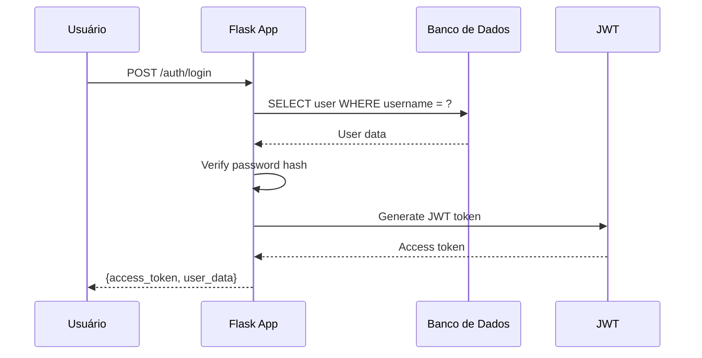
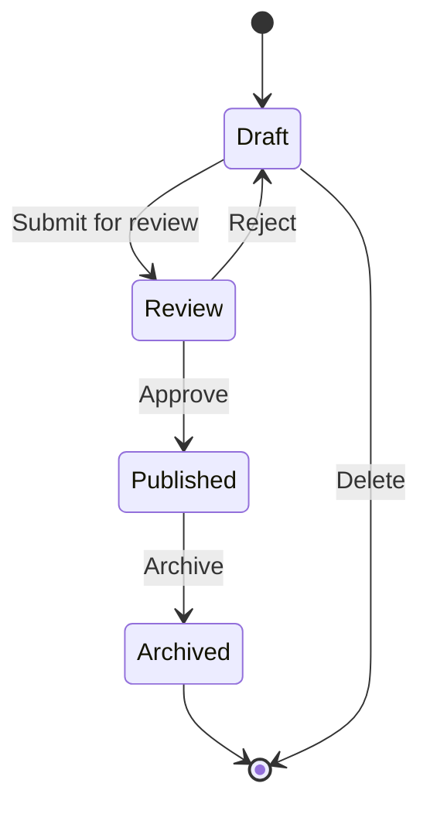
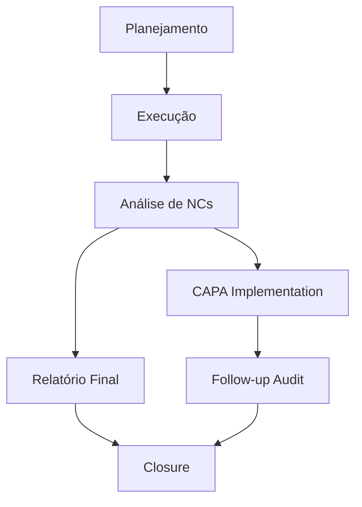

# Arquitetura do Sistema - Alphaclin QMS

## 📋 Visão Geral da Arquitetura

O Alphaclin QMS é desenvolvido seguindo princípios de arquitetura moderna, escalável e segura, utilizando tecnologias robustas para garantir alta disponibilidade e performance.

### 🏗️ Padrões Arquiteturais

- **Arquitetura MVC** (Model-View-Controller)
- **Padrão Repository** para acesso a dados
- **Padrão Service Layer** para lógica de negócio
- **Padrão Blueprint** para modularização Flask
- **API RESTful** para integrações

---

## 🛠️ Stack Tecnológico

### Backend
```python
# Framework Principal
Flask==2.3.3              # Framework web leve e flexível
Werkzeug==2.3.7          # WSGI utility library

# Banco de Dados
SQLAlchemy==2.0.23       # ORM moderno e poderoso
Flask-SQLAlchemy==3.1.1  # Integração Flask-SQLAlchemy
Flask-Migrate==4.0.5     # Migrações de banco de dados

# Autenticação e Segurança
Flask-Login==0.6.3       # Gerenciamento de sessões
PyJWT==2.8.0             # JSON Web Tokens
Werkzeug-Security==1.0.1 # Utilitários de segurança
cryptography==41.0.7     # Criptografia avançada

# APIs e Integrações
Flask-RESTful==0.3.10    # Desenvolvimento de APIs REST
Flask-CORS==4.0.0        # Cross-Origin Resource Sharing
```

### Frontend
```javascript
// Framework CSS
Tailwind CSS 3.3.3       // Utility-first CSS framework
Bootstrap 5.3.0          // Framework CSS responsivo

// JavaScript
Vanilla JavaScript ES6+   // JavaScript moderno
TinyMCE 6.7.0           // Editor rich text
Highlight.js 11.8.0     // Syntax highlighting
```

### Banco de Dados
```sql
-- Suporte a múltiplos bancos
SQLite 3.41+            -- Desenvolvimento e testes
PostgreSQL 15+          -- Produção (recomendado)
MySQL 8.0+             -- Alternativa enterprise
```

### Infraestrutura
```yaml
# Containerização
Docker 24+              # Container runtime
Docker Compose 2.17+    # Orquestração de containers

# Servidor Web
Gunicorn 21.2+         # WSGI HTTP Server
Nginx 1.24+            # Reverse proxy e load balancer

# Cache e Sessões
Redis 7.0+             # Cache e armazenamento de sessões
```

---

## 🏛️ Estrutura do Projeto

```
alphaclin-qms/
├── app.py                 # Aplicação principal Flask
├── config.py             # Configurações da aplicação
├── models.py             # Modelos de dados SQLAlchemy
├── requirements.txt      # Dependências Python
├── setup.py             # Script de instalação automática
├── pyproject.toml       # Configuração Poetry (opcional)
├── .env                 # Variáveis de ambiente
├── instance/            # Dados da instância
│   └── alphaclin_qms.db # Banco SQLite
├── blueprints/          # Módulos da aplicação
│   ├── __init__.py
│   ├── auth.py         # Autenticação e usuários
│   ├── main.py         # Dashboard e páginas principais
│   ├── documents.py    # Gestão documental
│   ├── audits.py       # Gestão de auditorias
│   ├── norms.py        # Gestão de normas
│   ├── processes.py    # Mapeamento de processos
│   ├── teams.py        # Gestão de equipes
│   ├── users.py        # Administração de usuários
│   ├── operational.py  # Módulos operacionais
│   ├── nonconformities.py # Não conformidades
│   ├── reports.py      # Relatórios e métricas
│   └── docs.py         # Sistema de documentação
├── static/              # Arquivos estáticos
│   ├── css/
│   ├── js/
│   ├── images/
│   └── uploads/
├── templates/           # Templates Jinja2
│   ├── base.html       # Template base
│   ├── dashboard.html  # Dashboard principal
│   ├── auth/           # Templates de autenticação
│   ├── documents/      # Templates documentais
│   ├── audits/         # Templates de auditorias
│   ├── reports/        # Templates de relatórios
│   └── ...
├── docs/               # Documentação do sistema
│   ├── index.md        # Página inicial
│   ├── installation/
│   ├── features/
│   ├── api/
│   ├── development/
│   └── future/
├── migrations/         # Migrações do banco
├── tests/              # Testes automatizados
├── scripts/            # Scripts utilitários
└── docker/             # Configurações Docker
    ├── Dockerfile
    ├── docker-compose.yml
    └── nginx.conf
```

---

## 🗂️ Estrutura dos Modelos de Dados

### Diagrama Entidade-Relacionamento

```
┌─────────────────┐     ┌─────────────────┐
│     User        │     │      Team       │
├─────────────────┤     ├─────────────────┤
│ id (PK)         │     │ id (PK)         │
│ username        │     │ name            │
│ email           │     │ description     │
│ password_hash   │     │ is_active       │
│ full_name       │     │ created_at      │
│ role            │     └─────────────────┘
│ is_active       │             │
│ created_at      │             │
│ last_login      │             │
└─────────────────┘             │
        │                       │
        │                       │
        ▼                       ▼
┌─────────────────┐     ┌─────────────────┐
│   Document      │     │  team_members   │
├─────────────────┤     │ (associative)   │
│ id (PK)         │     ├─────────────────┤
│ title           │     │ team_id (FK)    │
│ code            │     │ user_id (FK)    │
│ content         │     └─────────────────┘
│ version         │
│ status          │
│ created_by (FK) │
│ reviewed_by (FK)│
│ published_by(FK)│
└─────────────────┘
        │
        │
        ▼
┌─────────────────┐     ┌─────────────────┐
│ DocumentVersion │     │ DocumentRead    │
├─────────────────┤     ├─────────────────┤
│ id (PK)         │     │ id (PK)         │
│ document_id (FK)│     │ document_id (FK)│
│ version         │     │ user_id (FK)    │
│ content         │     │ read_at         │
│ created_by (FK) │     │ confirmed       │
│ created_at      │     │ confirmation_date│
└─────────────────┘     └─────────────────┘
```

### Relacionamentos Complexos

```
┌─────────────────┐     ┌─────────────────┐
│      Audit      │     │ NonConformity  │
├─────────────────┤     ├─────────────────┤
│ id (PK)         │◄────┤ id (PK)         │
│ title           │     │ audit_id (FK)   │
│ audit_type      │     │ title           │
│ norm_id (FK)    │     │ description     │
│ status          │     │ severity        │
│ progress_%      │     │ status          │
└─────────────────┘     └─────────────────┘
        │                       │
        │                       │
        ▼                       ▼
┌─────────────────┐     ┌─────────────────┐
│      Norm       │     │      Process    │
├─────────────────┤     ├─────────────────┤
│ id (PK)         │     │ id (PK)         │
│ name            │     │ name            │
│ code            │     │ code            │
│ description     │     │ description     │
│ version         │     │ inputs (JSON)   │
│ effective_date  │     │ outputs (JSON)  │
│ review_date     │     │ responsibilities│
│ is_active       │     │ risks (JSON)    │
└─────────────────┘     └─────────────────┘
```

---

## 🔄 Fluxos de Dados

### Fluxo de Autenticação



### Fluxo de Gestão Documental



### Fluxo de Auditoria



---

## 🔒 Segurança e Conformidade

### Autenticação e Autorização

```python
# Implementação JWT
from flask_jwt_extended import JWTManager, jwt_required, get_jwt_identity

jwt = JWTManager(app)

@app.route('/api/protected')
@jwt_required()
def protected():
    current_user_id = get_jwt_identity()
    return {'message': f'Hello user {current_user_id}'}
```

### Controle de Acesso Baseado em Roles

```python
class UserRole(Enum):
    ADMIN = "admin"      # Acesso total
    MANAGER = "manager"  # Gestão de equipe
    USER = "user"        # Acesso básico
    AUDITOR = "auditor"  # Auditorias
    REVIEWER = "reviewer" # Revisão de documentos

# Decorator para controle de permissões
def role_required(*roles):
    def decorator(f):
        @wraps(f)
        def decorated_function(*args, **kwargs):
            if current_user.role.value not in roles:
                abort(403)
            return f(*args, **kwargs)
        return decorated_function
    return decorator

@app.route('/admin/users')
@login_required
@role_required('admin')
def admin_users():
    # Apenas admins podem acessar
    pass
```

### Criptografia de Dados Sensíveis

```python
from cryptography.fernet import Fernet

# Geração de chave
key = Fernet.generate_key()
cipher = Fernet(key)

# Criptografia
encrypted = cipher.encrypt(b"dados sensiveis")

# Descriptografia
decrypted = cipher.decrypt(encrypted)
```

### Logs de Auditoria

```python
import logging

# Configuração de logging
logging.basicConfig(
    filename='audit.log',
    level=logging.INFO,
    format='%(asctime)s - %(user)s - %(action)s - %(resource)s'
)

def audit_log(user, action, resource, details=None):
    logging.info(f'User: {user}, Action: {action}, Resource: {resource}, Details: {details}')
```

---

## 📊 Monitoramento e Observabilidade

### Métricas de Sistema

```python
from flask import g
import time

@app.before_request
def before_request():
    g.start_time = time.time()

@app.after_request
def after_request(response):
    if hasattr(g, 'start_time'):
        duration = time.time() - g.start_time
        # Log request duration
        logger.info(f"Request {request.path} took {duration:.2f}s")
    return response
```

### Health Checks

```python
@app.route('/health')
def health_check():
    # Verificar conectividade com banco
    try:
        db.session.execute(text('SELECT 1'))
        db_status = 'healthy'
    except Exception:
        db_status = 'unhealthy'

    # Verificar espaço em disco
    import shutil
    total, used, free = shutil.disk_usage('/')
    disk_usage = (used / total) * 100

    return {
        'status': 'healthy' if db_status == 'healthy' else 'unhealthy',
        'database': db_status,
        'disk_usage_percent': round(disk_usage, 2),
        'timestamp': datetime.utcnow().isoformat()
    }
```

### APM (Application Performance Monitoring)

```python
# Integração com ferramentas como DataDog, New Relic, etc.
from flask import request

@app.after_request
def log_request_info(response):
    # Enviar métricas para APM
    metrics = {
        'method': request.method,
        'endpoint': request.endpoint,
        'status_code': response.status_code,
        'response_time': time.time() - g.start_time,
        'user_agent': request.headers.get('User-Agent'),
        'ip': request.remote_addr
    }
    # send_to_apm(metrics)
    return response
```

---

## 🚀 Estratégias de Deploy

### Desenvolvimento

```yaml
# docker-compose.dev.yml
version: '3.8'
services:
  app:
    build: .
    ports:
      - "5000:5000"
    environment:
      - FLASK_ENV=development
      - FLASK_DEBUG=1
    volumes:
      - .:/app
    depends_on:
      - db

  db:
    image: postgres:15
    environment:
      - POSTGRES_DB=alphaclin_dev
      - POSTGRES_USER=dev
      - POSTGRES_PASSWORD=dev123
```

### Produção

```yaml
# docker-compose.prod.yml
version: '3.8'
services:
  app:
    build:
      context: .
      dockerfile: Dockerfile.prod
    ports:
      - "8000:8000"
    environment:
      - FLASK_ENV=production
    depends_on:
      - db
      - redis

  db:
    image: postgres:15
    environment:
      - POSTGRES_DB=alphaclin_prod
      - POSTGRES_USER=${DB_USER}
      - POSTGRES_PASSWORD=${DB_PASSWORD}
    volumes:
      - postgres_data:/var/lib/postgresql/data

  redis:
    image: redis:7-alpine
    volumes:
      - redis_data:/data

  nginx:
    image: nginx:alpine
    ports:
      - "80:80"
      - "443:443"
    volumes:
      - ./nginx.conf:/etc/nginx/nginx.conf
      - ssl_certs:/etc/ssl/certs
    depends_on:
      - app
```

### Configuração Nginx

```nginx
upstream alphaclin_app {
    server app:8000;
}

server {
    listen 80;
    server_name alphaclin.com;

    location / {
        proxy_pass http://alphaclin_app;
        proxy_set_header Host $host;
        proxy_set_header X-Real-IP $remote_addr;
        proxy_set_header X-Forwarded-For $proxy_add_x_forwarded_for;
        proxy_set_header X-Forwarded-Proto $scheme;
    }

    location /static {
        alias /app/static;
        expires 1y;
        add_header Cache-Control "public, immutable";
    }
}
```

---

## 🔧 Manutenção e Operações

### Backup e Recovery

```bash
# Backup do banco PostgreSQL
pg_dump -U alphaclin -h localhost alphaclin_prod > backup_$(date +%Y%m%d_%H%M%S).sql

# Backup de arquivos
tar -czf uploads_backup_$(date +%Y%m%d).tar.gz uploads/

# Restauração
psql -U alphaclin -d alphaclin_prod < backup.sql
```

### Atualizações

```bash
# Estratégia blue-green deployment
# 1. Deploy nova versão em ambiente staging
# 2. Executar testes automatizados
# 3. Migrar tráfego para nova versão
# 4. Monitorar métricas
# 5. Remover versão antiga
```

### Escalabilidade

```yaml
# Horizontal scaling com Docker Swarm/Kubernetes
version: '3.8'
services:
  app:
    image: alphaclin/qms:latest
    deploy:
      replicas: 3
      resources:
        limits:
          cpus: '0.50'
          memory: 512M
        reservations:
          cpus: '0.25'
          memory: 256M
    depends_on:
      - db
      - redis

  nginx:
    image: nginx:alpine
    ports:
      - "80:80"
    deploy:
      replicas: 2
```

---

## 📈 Performance e Otimização

### Otimizações de Banco de Dados

```python
# Índices estratégicos
from sqlalchemy import Index

Index('idx_document_status', Document.status)
Index('idx_audit_norm', Audit.norm_id)
Index('idx_user_role', User.role)

# Queries otimizadas
documents = Document.query.options(joinedload(Document.author)).filter_by(status='published').all()
```

### Cache de Aplicação

```python
from flask_caching import Cache

cache = Cache(app, config={
    'CACHE_TYPE': 'redis',
    'CACHE_REDIS_URL': 'redis://localhost:6379/0'
})

@app.route('/api/dashboard')
@cache.cached(timeout=300)  # Cache por 5 minutos
def dashboard_data():
    return get_dashboard_metrics()
```

### CDN para Assets Estáticos

```html
<!-- CDN para bibliotecas comuns -->
<script src="https://cdn.jsdelivr.net/npm/bootstrap@5.3.0/dist/js/bootstrap.bundle.min.js"></script>
<link href="https://cdn.jsdelivr.net/npm/bootstrap@5.3.0/dist/css/bootstrap.min.css" rel="stylesheet">

<!-- Assets locais versionados -->
<link href="/static/css/app.v123.css" rel="stylesheet">
<script src="/static/js/app.v123.js"></script>
```

---

## 🔮 Evolução Arquitetural

### Microserviços (Futuro)

```
┌─────────────────┐    ┌─────────────────┐    ┌─────────────────┐
│   API Gateway   │    │  Auth Service   │    │  User Service   │
│   (Kong/Nginx)  │    │   (JWT/OAuth)   │    │   (Profiles)     │
└─────────────────┘    └─────────────────┘    └─────────────────┘
          │                       │                       │
          └───────────────────────┼───────────────────────┘
                                  │
                    ┌─────────────────┐
                    │  Document       │
                    │  Service        │
                    │  (Core QMS)     │
                    └─────────────────┘
```

### Serverless (Opcional)

```yaml
# AWS Lambda + API Gateway
functions:
  createDocument:
    handler: handlers/document.create
    events:
      - http:
          path: documents
          method: post
          authorizer: aws_iam

  getDocument:
    handler: handlers/document.get
    events:
      - http:
          path: documents/{id}
          method: get
```

### GraphQL API (Futuro)

```graphql
type Query {
  documents(status: DocumentStatus, limit: Int): [Document!]!
  document(id: ID!): Document
  user(id: ID!): User
}

type Mutation {
  createDocument(input: CreateDocumentInput!): Document!
  updateDocument(id: ID!, input: UpdateDocumentInput!): Document!
  deleteDocument(id: ID!): Boolean!
}
```

---

## 📚 Referências e Padrões

### Padrões de Design Implementados

- **Repository Pattern**: Abstração do acesso a dados
- **Unit of Work**: Gerenciamento de transações
- **Dependency Injection**: Injeção de dependências
- **Observer Pattern**: Notificações do sistema
- **Strategy Pattern**: Algoritmos de workflow

### Normas e Padrões

- **ISO 9001**: Sistema de Gestão da Qualidade
- **OWASP**: Segurança de aplicações web
- **REST**: API design principles
- **12-Factor App**: Metodologia para aplicações SaaS
- **SOLID**: Princípios de design orientado a objetos

### Documentação Técnica

- **OpenAPI 3.0**: Especificação de APIs
- **AsyncAPI**: Documentação de eventos
- **Database Schema**: Documentação do modelo de dados
- **Architecture Decision Records**: Decisões arquiteturais

---

**Última atualização: Janeiro 2025**