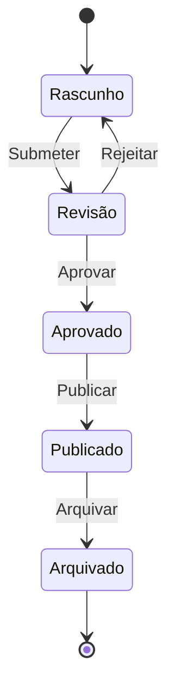

# 📄 Gestão Documental - Visão Geral

A **Gestão Documental** do Alphaclin QMS é o coração do sistema, oferecendo um workflow completo para criação, aprovação e controle de documentos em instituições de saúde.

## 🎯 Objetivos

- **Centralizar** todos os documentos da instituição
- **Garantir conformidade** com normas regulatórias
- **Controlar versões** e alterações
- **Automatizar** processos de aprovação
- **Assegurar** leitura e compreensão

## 📋 Funcionalidades Principais

### ✍️ Criação de Documentos

#### Editor Rico
- **TinyMCE** integrado
- **Formatação avançada** (negrito, itálico, listas)
- **Tabelas** e imagens
- **Links** e referências
- **Pré-visualização** em tempo real

#### Metadados Essenciais
- **Título** descritivo
- **Código** único (ex: PROC-001)
- **Categoria** (Procedimentos, Instruções, Formulários)
- **Palavras-chave** para busca
- **Prazo de revisão**

#### Organização Hierárquica
```
📁 Documentos
├── 📁 Procedimentos
│   ├── 📄 PROC-001 - Higienização de Mãos
│   └── 📄 PROC-002 - Calibração de Equipamentos
├── 📁 Instruções
│   ├── 📄 INST-001 - Uso de EPI
│   └── 📄 INST-002 - Protocolo de Emergência
└── 📁 Formulários
    ├── 📄 FORM-001 - Checklist de Auditoria
    └── 📄 FORM-002 - Relatório de NC
```

### 🔄 Workflow de Aprovação

#### Estados do Documento


#### Papéis e Responsabilidades

| Papel | Responsabilidades |
|-------|------------------|
| **Criador** | Redige o documento |
| **Revisor** | Verifica conteúdo e conformidade |
| **Aprovador** | Autoriza publicação |
| **Leitor** | Confirma leitura e compreensão |

#### Notificações Automáticas
- ✅ **Criador**: Documento aprovado/rejeitado
- ✅ **Revisor**: Novo documento para revisão
- ✅ **Leitores**: Documento publicado para leitura

### 📋 Controle de Versões

#### Versionamento Semântico
- **Major** (X.0): Mudanças significativas
- **Minor** (1.X): Correções e melhorias
- **Histórico** completo de alterações

#### Comparação Visual
- **Diff** entre versões
- **Alterações destacadas**
- **Comentários** de mudança
- **Responsável** pela alteração

#### Rastreabilidade
- **Quem** alterou
- **Quando** alterou
- **Por quê** alterou
- **O que** foi alterado

### ✍️ Assinaturas Eletrônicas

#### Tecnologia
- **Criptografia SHA-256** válida legalmente
- **Certificado digital** com metadados
- **Timestamp** de assinatura
- **Conformidade LGPD**

#### Tipos de Assinatura
- **Aprovação**: Autoriza publicação
- **Revisão**: Confirma análise
- **Leitura**: Confirma compreensão

#### Trilha de Auditoria
```json
{
  "document_id": "PROC-001",
  "user_id": "admin",
  "user_name": "Administrator",
  "signature_type": "approval",
  "timestamp": "2025-01-15T10:30:00Z",
  "ip_address": "192.168.1.100",
  "user_agent": "Mozilla/5.0...",
  "certificate_info": {
    "user_id": "admin",
    "user_name": "Administrator",
    "user_email": "admin@alphaclin.com"
  }
}
```

### 📖 Gestão de Leitura

#### Leitura Obrigatória
- **Definição** de documentos críticos
- **Atribuição** por equipe/função
- **Prazos** de leitura
- **Lembretes** automáticos

#### Confirmação de Leitura
- **Assinatura digital** obrigatória
- **Data/hora** de leitura
- **Certificado** de compreensão
- **Relatórios** de conformidade

#### Relatórios de Leitura
- **Taxa de conformidade** por documento
- **Usuários pendentes** de leitura
- **Histórico** de confirmações
- **Alertas** de não conformidade

## 🔍 Busca e Filtros

### Busca Avançada
- **Texto completo** em conteúdo
- **Metadados** (título, código, categoria)
- **Tags** e palavras-chave
- **Datas** de criação/modificação
- **Status** e versão

### Filtros Disponíveis
- **Status**: Rascunho, Revisão, Publicado, Arquivado
- **Categoria**: Procedimentos, Instruções, Formulários
- **Autor**: Criador do documento
- **Período**: Data de criação/modificação
- **Equipe**: Documentos por equipe

## 📊 Relatórios Documentais

### Indicadores Principais
- **Total de documentos** por status
- **Tempo médio** de aprovação
- **Taxa de conformidade** de leitura
- **Produtividade** por usuário
- **Documentos** por categoria

### Dashboards
- **Visão geral** do acervo documental
- **Workflow** em andamento
- **Leituras pendentes**
- **Auditoria** documental

## 🔗 Integrações

### APIs Disponíveis
```javascript
// Criar documento
POST /api/documents
{
  "title": "Procedimento de Emergência",
  "content": "<p>Conteúdo HTML</p>",
  "category": "Procedimentos",
  "reviewer_id": "user123"
}

// Listar documentos
GET /api/documents?status=published&category=procedimentos

// Assinar documento
POST /api/documents/{id}/sign
{
  "signature_type": "reading",
  "context": "Confirmação de leitura"
}
```

### Webhooks
- **Documento aprovado**: Notificar sistemas externos
- **Nova versão**: Alertar usuários
- **Leitura confirmada**: Atualizar dashboards

## 📱 Responsividade

### Interface Adaptável
- **Desktop**: Editor completo, visualizações lado a lado
- **Tablet**: Interface otimizada, toque intuitivo
- **Mobile**: Leitura simplificada, assinaturas touch

### Acesso Remoto
- **VPN** para acesso seguro
- **Autenticação 2FA** (planejado)
- **Logs** de acesso remoto

## 🔒 Segurança

### Controle de Acesso
- **Permissões granulares** por documento
- **Encriptação** em trânsito e repouso
- **Backups** automáticos
- **Recuperação** de desastres

### Conformidade
- **LGPD**: Proteção de dados pessoais
- **ISO 9001**: Gestão documental
- **ONA**: Normas de acreditação
- **RDC**: Regulamentações sanitárias

## 🎯 Benefícios

### Para a Instituição
- **Conformidade** garantida
- **Redução** de papel
- **Agilidade** nos processos
- **Rastreabilidade** completa

### Para os Usuários
- **Interface intuitiva**
- **Automação** de tarefas
- **Acesso centralizado**
- **Mobilidade** garantida

### Para a Gestão
- **Visibilidade** total
- **Controle** efetivo
- **Relatórios** automatizados
- **Tomada de decisão** informada

## 🚀 Próximas Funcionalidades

### Em Desenvolvimento
- **📱 App Mobile** para leitura offline
- **🤖 IA** para análise de conteúdo
- **🔍 OCR** para digitalização
- **📊 Analytics** avançado

### Planejadas
- **🎯 BPMN** para workflows complexos
- **🔗 Blockchain** para certificação
- **🌐 PWA** progressiva
- **💬 Chat** integrado

---

*Para detalhes técnicos sobre implementação, consulte a [documentação de desenvolvimento](../development/architecture.md).* 