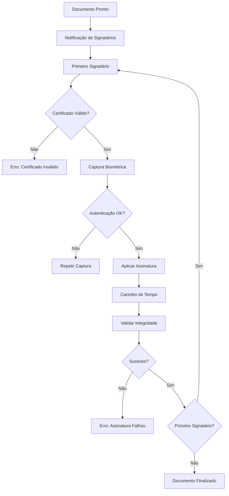

# ✍️ Assinaturas Digitais - AlphaClinic QMS

## Visão Geral

O sistema de assinaturas digitais do AlphaClinic QMS oferece conformidade legal completa com a legislação brasileira (ICP-Brasil) e normas internacionais, garantindo validade jurídica para documentos eletrônicos em ambientes clínicos.

## 🔐 Conformidade Legal

### Legislação Brasileira
- **Lei 14.063/2020**: Assinatura eletrônica avançada
- **MP 2.200-2/2001**: Infraestrutura de Chaves Públicas Brasileira (ICP-Brasil)
- **Código Civil**: Artigos 104 e 107 sobre validade de documentos digitais

### Normas Técnicas
- **DOC-ICP-15**: Padrões técnicos do ICP-Brasil
- **ISO 27001**: Gestão de segurança da informação
- **ISO 9001**: Gestão da qualidade

## 📋 Tipos de Assinatura

### 1. Assinatura Eletrônica Simples
- **Uso**: Documentos internos de baixo risco
- **Características**:
  - Login e senha
  - IP e timestamp
  - Não criptografada
- **Validade jurídica**: Limitada

### 2. Assinatura Eletrônica Avançada
- **Uso**: Documentos de média importância
- **Características**:
  - Certificado digital pessoal
  - Biometria opcional
  - Criptografia assimétrica
- **Validade jurídica**: Média

### 3. Assinatura Eletrônica Qualificada
- **Uso**: Documentos críticos (prontuários, contratos)
- **Características**:
  - Certificado ICP-Brasil A1, A3 ou A4
  - Biometria obrigatória
  - Carimbo de tempo qualificado
  - Auditoria completa
- **Validade jurídica**: Plena

## 🔧 Configuração Técnica

### Certificados Digitais

#### Tipos de Certificado Suportados
```javascript
const supportedCertificates = {
  "A1": {
    "description": "Arquivo digital (software)",
    "validity": "1 ano",
    "storage": "Computador/Token",
    "use": "Assinatura remota"
  },
  "A3": {
    "description": "Cartão ou Token USB",
    "validity": "1-3 anos",
    "storage": "Hardware criptográfico",
    "use": "Assinatura com proteção física"
  },
  "A4": {
    "description": "Servidor HSM",
    "validity": "1-5 anos",
    "storage": "Hardware Security Module",
    "use": "Alto volume de assinaturas"
  }
};
```

#### Autoridades Certificadoras Credenciadas
- ✅ Serasa Experian
- ✅ Certisign
- ✅ Valid Certificadora
- ✅ Digitalsign
- ✅ Caixa Econômica Federal

### Integração com Dispositivos Biométricos

#### Leitores Suportados
- **Huion Kamvas** (mesa digitalizadora)
- **Wacom** (tablets profissionais)
- **Topaz** (assinatura digital)
- **Câmeras** (reconhecimento facial)

#### Configuração de Biometria
```bash
# Configurações de captura biométrica
BIOMETRIC_MIN_QUALITY=0.8      # Qualidade mínima (0-1)
BIOMETRIC_TIMEOUT=30           # Timeout em segundos
BIOMETRIC_RETRIES=3            # Tentativas permitidas

# Dispositivos suportados
SUPPORTED_DEVICES=huion,wacom,topaz,camera
```

## 📝 Processo de Assinatura

### 1. Preparação do Documento

#### Seleção de Signatários
```javascript
const signatories = [
  {
    "user_id": 1,
    "role": "creator",
    "signature_type": "elaborador",
    "required": true,
    "order": 1
  },
  {
    "user_id": 2,
    "role": "reviewer",
    "signature_type": "revisor",
    "required": true,
    "order": 2
  },
  {
    "user_id": 3,
    "role": "approver",
    "signature_type": "aprovador",
    "required": true,
    "order": 3
  }
];
```

#### Configuração de Regras
- **Ordem obrigatória**: Assinaturas sequenciais
- **Assinatura paralela**: Múltiplas assinaturas simultâneas
- **Testemunhas**: Assinaturas adicionais para validade
- **Visto**: Aprovação sem assinatura formal

### 2. Processo de Assinatura

#### Fluxo de Assinatura


### 3. Validação e Verificação

#### Validação Técnica
- **Integridade do documento**: Hash SHA-256
- **Validade do certificado**: Verificação da cadeia de confiança
- **Carimbo de tempo**: Sincronização com servidor NTP
- **Biometria**: Comparação com padrões armazenados

#### Verificação Jurídica
```javascript
// Processo de verificação
const verification = {
  "certificate_chain": "Verificar AC credenciada",
  "timestamp": "Verificar servidor de tempo",
  "biometric": "Comparar com padrão armazenado",
  "document_integrity": "Recalcular hash",
  "legal_compliance": "Verificar conformidade ICP-Brasil"
};
```

## 🔒 Segurança e Auditoria

### Criptografia e Proteção

#### Algoritmos Utilizados
- **Assinatura**: RSA 2048/4096 bits ou ECDSA P-256/P-384
- **Hash**: SHA-256/SHA-384/SHA-512
- **Criptografia**: AES-256-GCM para dados sensíveis
- **Troca de chaves**: ECDH com curva P-256

#### Proteção de Chaves Privadas
```javascript
const keyProtection = {
  "A1": {
    "storage": "Arquivo protegido por senha",
    "encryption": "AES-256",
    "access_control": "PIN/Token"
  },
  "A3": {
    "storage": "Hardware criptográfico",
    "encryption": "HSM integrado",
    "access_control": "PIN físico"
  },
  "A4": {
    "storage": "HSM dedicado",
    "encryption": "Módulo de segurança",
    "access_control": "Controle de acesso duplo"
  }
};
```

### Auditoria Completa

#### Registro de Eventos
- 📅 **Timestamp**: Data/hora exata da assinatura
- 🌐 **IP/Location**: Endereço IP e localização geográfica
- 🔐 **Certificado**: Dados do certificado utilizado
- 👤 **Biometria**: Dados biométricos (hash)
- 📄 **Documento**: Hash e metadados
- 🔗 **Transação**: ID único da operação

#### Retenção de Dados
```bash
# Configurações de retenção
AUDIT_LOG_RETENTION=2555  # 7 anos conforme legislação
BIOMETRIC_DATA_RETENTION=365  # 1 ano para dados biométricos
CERTIFICATE_DATA_RETENTION=2555  # Manter com documento
```

## 📱 Interface do Usuário

### Processo de Assinatura

#### Tela de Assinatura
```html
<!-- Interface de assinatura -->
<div class="signature-interface">
  <div class="document-preview">
    <!-- Visualização do documento -->
  </div>

  <div class="signature-area">
    <canvas id="signature-pad" width="600" height="200">
      <!-- Área de assinatura digital -->
    </canvas>

    <div class="biometric-capture">
      <!-- Captura biométrica -->
      <video id="biometric-camera" autoplay></video>
    </div>

    <div class="certificate-info">
      <!-- Informações do certificado -->
      <p>Certificado: João Silva - CPF: 123.456.789-00</p>
      <p>Validade: 01/01/2024 - 31/12/2024</p>
      <p>Autoridade: Serasa Experian</p>
    </div>
  </div>

  <div class="actions">
    <button onclick="clearSignature()">Limpar</button>
    <button onclick="captureBiometric()">Capturar Biometria</button>
    <button onclick="signDocument()">Assinar Documento</button>
  </div>
</div>
```

### Validação Visual

#### Elementos de Segurança Visuais
- 🔐 **Selo digital**: Indicador visual de autenticidade
- 📅 **Carimbo de tempo**: Data/hora da assinatura
- 👤 **Identificação do signatário**: Nome e função
- 🔗 **Código de verificação**: QR Code para validação externa

## 🔧 APIs e Integrações

### API de Assinatura

#### Endpoint de Assinatura
```bash
# Assinar documento
POST /api/v1/documents/{id}/sign
Content-Type: application/json
X-API-Key: sua-api-key
X-Digital-Certificate: certificado-base64

{
  "signature_type": "qualified",
  "biometric_data": "dados-biometricos-base64",
  "certificate_pin": "pin-do-certificado",
  "metadata": {
    "ip_address": "192.168.1.100",
    "user_agent": "Mozilla/5.0...",
    "location": "São Paulo, SP"
  }
}
```

#### Resposta da API
```json
{
  "success": true,
  "signature_id": "sig_abc123def456",
  "timestamp": "2024-12-01T10:30:00Z",
  "certificate_info": {
    "serial": "123456789",
    "issuer": "AC Serasa Experian",
    "valid_from": "2024-01-01T00:00:00Z",
    "valid_to": "2024-12-31T23:59:59Z"
  },
  "document_hash": "sha256:a1b2c3d4e5f6...",
  "audit_trail": "audit_abc123def456"
}
```

### Webhooks de Assinatura

#### Eventos Disponíveis
- `document.signed`: Documento assinado
- `document.all_signed`: Todas as assinaturas coletadas
- `signature.verified`: Assinatura verificada
- `signature.expired`: Certificado expirado

#### Payload do Webhook
```json
{
  "event": "document.signed",
  "timestamp": "2024-12-01T10:30:00Z",
  "document": {
    "id": 123,
    "code": "PROC-001",
    "title": "Procedimento de Higienização",
    "version": "1.0"
  },
  "signature": {
    "id": "sig_abc123def456",
    "type": "qualified",
    "signatory": {
      "id": 1,
      "name": "João Silva",
      "role": "Enfermeiro Chefe"
    }
  },
  "verification_url": "https://qms.alphaclin.com/verify/sig_abc123def456"
}
```

## 📊 Relatórios e Métricas

### Indicadores de Assinatura

#### KPIs Disponíveis
- 📈 **Taxa de sucesso de assinaturas**: Meta > 95%
- ⏱️ **Tempo médio de assinatura**: Meta < 2 minutos
- 📅 **Assinaturas por dia/mês**: Acompanhamento de volume
- 🔐 **Taxa de validação biométrica**: Meta > 98%

#### Dashboards
- 📊 **Status de assinaturas pendentes**
- ⏰ **Documentos aguardando assinatura**
- 📈 **Métricas de performance**
- 🔍 **Auditoria de assinaturas**

### Relatórios de Conformidade

#### Relatório de Assinaturas
```bash
# Relatório mensal de assinaturas
GET /api/v1/reports/signatures/monthly?year=2024&month=12

# Resposta
{
  "total_signatures": 150,
  "by_type": {
    "simple": 45,
    "advanced": 75,
    "qualified": 30
  },
  "by_department": {
    "enfermagem": 60,
    "qualidade": 45,
    "administrativo": 45
  },
  "compliance_rate": 0.98,
  "average_time": "1m 45s"
}
```

## 🚨 Tratamento de Erros

### Cenários de Falha

#### Certificado Inválido
```javascript
const certificateErrors = {
  "expired": "Certificado digital expirado",
  "revoked": "Certificado revogado pela AC",
  "invalid_chain": "Cadeia de certificação inválida",
  "unsupported_type": "Tipo de certificado não suportado"
};
```

#### Falha Biométrica
```javascript
const biometricErrors = {
  "low_quality": "Qualidade da captura insuficiente",
  "no_match": "Biometria não confere com padrão",
  "device_error": "Problema no dispositivo biométrico",
  "timeout": "Tempo limite excedido"
};
```

#### Problemas de Rede
```javascript
const networkErrors = {
  "timestamp_unavailable": "Servidor de carimbo de tempo indisponível",
  "certificate_server_down": "Servidor de certificados inacessível",
  "audit_server_error": "Erro no servidor de auditoria"
};
```

## 🎯 Melhores Práticas

### Para Administradores
- ✅ Mantenha certificados sempre atualizados
- ✅ Configure alertas de vencimento (60 dias)
- ✅ Treine usuários regularmente
- ✅ Monitore métricas de assinatura
- ✅ Faça backups regulares dos dados de auditoria

### Para Usuários
- ✅ Mantenha certificado digital válido
- ✅ Use dispositivos biométricos de qualidade
- ✅ Verifique dados antes de assinar
- ✅ Mantenha PIN/Token em segurança
- ✅ Reporte problemas imediatamente

### Para TI/Suporte
- ✅ Monitore servidores de certificação
- ✅ Mantenha integrações atualizadas
- ✅ Teste assinaturas regularmente
- ✅ Documente procedimentos de contingência

## 📞 Suporte e Troubleshooting

### Problemas Comuns

#### Certificado Não Reconhecido
```bash
# Verificar instalação do certificado
certutil -user -store MY

# Testar validade
openssl x509 -in certificado.crt -text -noout

# Reinstalar drivers
# Dispositivos biométricos > Propriedades > Drivers
```

#### Falha na Biometria
```bash
# Verificar dispositivo
lsusb  # Linux
# Gerenciador de Dispositivos > Dispositivos Biométricos  # Windows

# Testar captura
python scripts/test_biometric.py
```

#### Problemas de Performance
```bash
# Monitorar recursos
htop  # Uso de CPU/Memória

# Logs de assinatura
tail -f logs/signature.log

# Otimizar configurações
# Ajustar timeouts e qualidade biométrica
```

## 🔮 Funcionalidades Futuras

### Próximas Implementações
- 📱 **Assinatura mobile** com Touch ID/Face ID
- 🤖 **Inteligência artificial** para validação biométrica
- ⛓️ **Blockchain** para auditoria imutável
- 🌐 **Assinatura remota** via certificação em nuvem
- 📋 **Lote de assinaturas** para alta volume

---

**Última atualização:** Dezembro 2024
**Versão:** 1.0.0