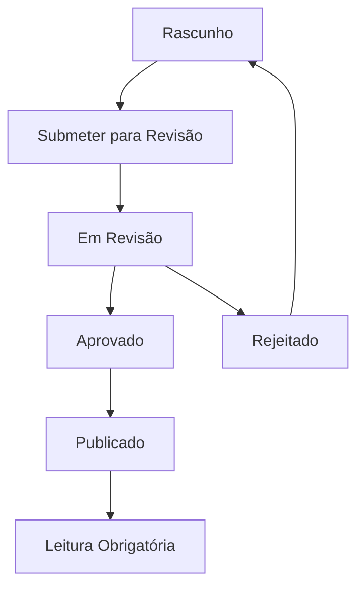
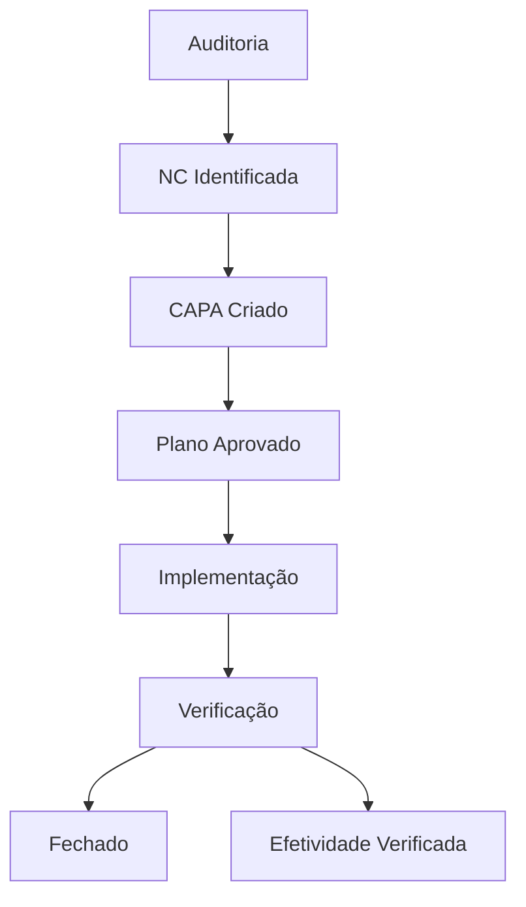
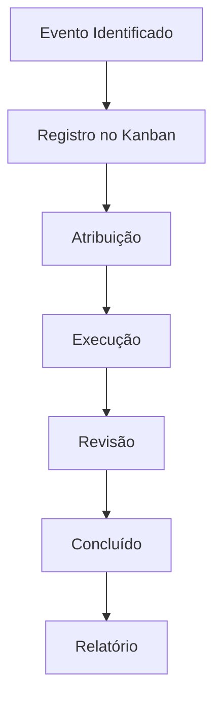

# 📋 Visão Geral das Funcionalidades

O Alphaclin QMS oferece um conjunto completo de ferramentas para gestão da qualidade em instituições de saúde, cobrindo todos os aspectos necessários para conformidade com normas regulatórias.

## 🎯 Funcionalidades Principais

### 📄 Gestão Documental

#### Workflow Completo
- **Redação**: Editor rico com TinyMCE
- **Revisão**: Atribuição de revisores
- **Aprovação**: Workflow multinível
- **Publicação**: Controle de acesso
- **Leitura**: Confirmação obrigatória

#### Controle de Versões
- Versionamento automático (1.0, 1.1, 2.0)
- Histórico completo de alterações
- Comparação entre versões
- Rastreabilidade de mudanças

#### Assinaturas Eletrônicas
- **Criptografia SHA-256** válida legalmente
- **Certificado digital** com metadados
- **Trilha de auditoria** completa
- **Conformidade LGPD**

#### Organização
- **Estrutura hierárquica** de pastas
- **Categorização** por tipo de documento
- **Tags** para busca avançada
- **Anexos** ilimitados

### 🔍 Gestão de Qualidade

#### Auditorias
- **Internas e externas**
- **Planejamento** com escopo definido
- **Execução** com checklist
- **Relatórios** automatizados
- **Acompanhamento** de ações

#### Não Conformidades (NCs)
- **Registro estruturado**
- **Classificação** por severidade
- **Atribuição** de responsáveis
- **Acompanhamento** de resolução
- **Relatórios** de tendência

#### CAPA (Corretivo/Preventivo)
- **5W2H** estruturado
- **Workflow** aprovado → implementado → verificado
- **Ações corretivas** e preventivas
- **Verificação** de efetividade
- **Relatórios** de melhoria

### 🏥 Operacional

#### CIPA (Comissão Interna de Prevenção de Acidentes)
- **Reuniões agendadas**
- **Atas** com decisões
- **Acompanhamento** de ações
- **Relatórios** de acidentes
- **Indicadores** de segurança

#### PDCA (Plan-Do-Check-Act)
- **Ciclos de melhoria** estruturados
- **Metodologia** padronizada
- **Acompanhamento** visual
- **Métricas** de sucesso
- **Relatórios** de melhoria

#### Kanban Operacional
- **Quadro visual** de tarefas
- **Colunas**: Todo, In Progress, Review, Done
- **Atribuição** de responsáveis
- **Prazos** e prioridades
- **Relatórios** de produtividade

### 👥 Sistema

#### Gestão de Usuários
- **Perfis**: Admin, Manager, Auditor, User
- **Autenticação** segura
- **Controle de acesso** granular
- **Logs** de atividade
- **Recuperação** de senha

#### Equipes Colaborativas
- **Criação** de equipes
- **Atribuição** de membros
- **Permissões** em grupo
- **Compartilhamento** de documentos
- **Notificações** coletivas

#### Notificações
- **E-mail** automático
- **Templates** personalizáveis
- **Fila** assíncrona
- **Preferências** por usuário
- **Histórico** completo

#### Relatórios
- **Dashboards** interativos
- **Indicadores** em tempo real
- **Exportação** PDF/Excel
- **Agendamento** automático
- **Personalização** por usuário

## 🔄 Workflows Integrados

### 📄 Processo Documental

### 🔍 Processo de Qualidade

### 🏥 Processo Operacional

## 📊 Indicadores e Métricas

### Documental
- **Taxa de aprovação**: Documentos aprovados/total
- **Tempo médio**: De criação à publicação
- **Conformidade**: Leituras confirmadas
- **Produtividade**: Documentos por usuário

### Qualidade
- **NCs abertas**: Por severidade e prazo
- **Taxa de resolução**: NCs resolvidas/total
- **Efetividade CAPA**: Ações bem-sucedidas
- **Auditorias**: Planejadas vs realizadas

### Operacional
- **Acidentes**: Tendência mensal
- **Melhorias**: Ciclos PDCA concluídos
- **Produtividade**: Tarefas concluídas
- **Conformidade**: Reuniões CIPA realizadas

## 🔗 Integrações

### APIs Disponíveis
- **REST API** completa
- **Webhooks** para eventos
- **OAuth2** para autenticação
- **JWT** para sessões

### Sistemas Externos
- **ERP** integração
- **HIS/LIS** conectores
- **WhatsApp Business** (planejado)
- **LDAP/Active Directory**

### Exportação
- **PDF** para documentos
- **Excel** para relatórios
- **CSV** para dados
- **API JSON** para integrações

## 🎯 Benefícios

### Para a Instituição
- **Conformidade** garantida com normas
- **Redução** de retrabalho
- **Aumento** da produtividade
- **Melhoria** na qualidade assistencial

### Para os Usuários
- **Interface intuitiva**
- **Automação** de processos
- **Acesso centralizado**
- **Mobilidade** (planejado)

### Para a Gestão
- **Visibilidade** completa dos processos
- **Tomada de decisão** baseada em dados
- **Auditorias facilitadas**
- **Relatórios** automatizados

## 🚀 Próximas Funcionalidades

### Planejadas para 2025
- **📱 App Mobile** nativo
- **💬 WhatsApp** integrado
- **📊 BI Analytics** avançado
- **🤖 IA** para análise de risco
- **🔗 API GraphQL** moderna
- **☁️ Cloud** deployment

### Em Desenvolvimento
- **🎯 BPMN** para processos
- **📈 Machine Learning** preditivo
- **🔐 Blockchain** para auditoria
- **🌐 PWA** progressiva

---

*Esta documentação é atualizada automaticamente com cada nova versão do sistema.*