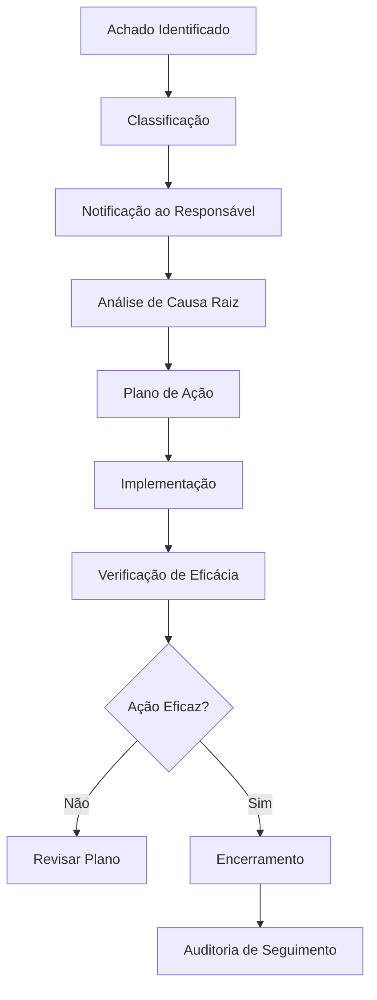

# 🔍 Sistema de Auditorias - AlphaClinic QMS

## Visão Geral

O módulo de auditorias do AlphaClinic QMS oferece ferramentas completas para planejamento, execução e acompanhamento de auditorias internas e externas, garantindo conformidade com normas ISO 9001, ISO 19011 e RDC ANVISA.

## 📋 Tipos de Auditoria

### Auditorias Internas

#### Auditoria de Sistema
- **Objetivo**: Verificar conformidade do SGQ
- **Escopo**: Todos os processos do sistema
- **Frequência**: Anual (mínimo)
- **Equipe**: Auditores internos treinados

#### Auditoria de Processo
- **Objetivo**: Avaliar processo específico
- **Escopo**: Processo selecionado + interfaces
- **Frequência**: Semestral ou conforme necessidade
- **Equipe**: Especialistas do processo + auditor

#### Auditoria de Produto
- **Objetivo**: Verificar qualidade de produtos/serviços
- **Escopo**: Produto/serviço específico
- **Frequência**: Conforme programação
- **Equipe**: Auditores com conhecimento técnico

### Auditorias Externas

#### Auditoria de Certificação
- **Objetivo**: Manutenção de certificações (ISO, ONA)
- **Escopo**: Requisitos da norma específica
- **Frequência**: Anual ou recertificação
- **Equipe**: Auditores credenciados

#### Auditoria de Vigilância
- **Objetivo**: Manutenção de certificações
- **Escopo**: Verificação de conformidade continuada
- **Frequência**: Semestral
- **Equipe**: Organismo certificador

#### Auditoria de Cliente
- **Objetivo**: Avaliação por clientes/parceiros
- **Escopo**: Conforme contrato/acordo
- **Frequência**: Conforme solicitação
- **Equipe**: Auditores do cliente

## 🗓️ Planejamento de Auditorias

### Cronograma Anual

#### Elaboração do Plano
```javascript
const auditPlan = {
  "year": 2024,
  "total_audits": 12,
  "by_quarter": {
    "Q1": 3,
    "Q2": 3,
    "Q3": 3,
    "Q4": 3
  },
  "by_type": {
    "system": 1,
    "process": 8,
    "product": 2,
    "supplier": 1
  },
  "resources": {
    "internal_auditors": 5,
    "training_hours": 40,
    "budget": 15000
  }
};
```

#### Processo de Planejamento
1. **Análise de riscos**: Identificar processos críticos
2. **Disponibilidade de recursos**: Auditores e tempo
3. **Requisitos normativos**: Prazos de certificações
4. **Histórico**: Baseado em auditorias anteriores
5. **Aprovação**: Validação por alta direção

### Critérios de Seleção

#### Fatores de Priorização
- 🎯 **Riscos identificados**: Processos com maior risco
- 📊 **Indicadores**: Processos com pior performance
- 👥 **Reclamações**: Áreas com mais reclamações
- 🔄 **Mudanças**: Processos recentemente alterados
- 📜 **Normas**: Requisitos de certificações

## 📋 Execução de Auditorias

### Preparação da Auditoria

#### Documentos Preparatórios
- 📋 **Plano de auditoria**: Objetivos e escopo
- 📋 **Lista de verificação**: Baseado em normas
- 📋 **Cronograma**: Agenda detalhada
- 📋 **Equipe**: Auditores designados
- 📋 **Recursos**: Materiais necessários

#### Comunicação Prévia
```bash
# Notificação aos auditados
NOTIFICATION_DAYS_BEFORE=15
NOTIFICATION_INCLUDE=objectives,scope,team,agenda
NOTIFICATION_METHODS=email,teams,calendar_invite
```

### Realização da Auditoria

#### Metodologia de Auditoria
1. **Reunião de abertura**: Apresentação e alinhamento
2. **Verificação documental**: Análise de registros
3. **Observação in loco**: Verificação da prática
4. **Entrevistas**: Coleta de informações
5. **Análise de dados**: Tratamento de evidências
6. **Reunião de encerramento**: Apresentação de achados

#### Técnicas de Coleta de Evidências
- 📄 **Exame de documentos**: Registros e formulários
- 👀 **Observação**: Práticas reais observadas
- 💬 **Entrevistas**: Informações de pessoal envolvido
- 📊 **Análise de dados**: Indicadores e métricas
- 🧪 **Testes**: Quando aplicável

## 📝 Registro de Achados

### Classificação de Não Conformidades

#### Gravidade das Não Conformidades
```javascript
const nonConformityLevels = {
  "critical": {
    "description": "Afeta segurança do paciente ou conformidade legal",
    "deadline_days": 7,
    "requires_immediate_action": true,
    "escalation": "Diretoria imediata"
  },
  "major": {
    "description": "Afeta sistema de gestão ou resultados",
    "deadline_days": 15,
    "requires_immediate_action": true,
    "escalation": "Gerência responsável"
  },
  "minor": {
    "description": "Não afeta significativamente o sistema",
    "deadline_days": 30,
    "requires_immediate_action": false,
    "escalation": "Supervisor responsável"
  },
  "observation": {
    "description": "Oportunidade de melhoria",
    "deadline_days": 60,
    "requires_immediate_action": false,
    "escalation": "Não requer"
  }
};
```

### Estrutura do Registro de Achados

#### Campos Obrigatórios
```javascript
const auditFinding = {
  "finding_id": "AUD-2024-001",
  "audit_id": 123,
  "process": "Higienização de Equipamentos",
  "requirement": "ISO 9001:2015 - 8.5.1",
  "description": "Procedimento de higienização não está sendo seguido conforme documentado",
  "evidence": [
    "Observação: Técnicos não utilizam EPIs adequados",
    "Registro: Planilha de controle desatualizada",
    "Entrevista: Funcionários desconhecem procedimento atual"
  ],
  "classification": "major",
  "auditor": "João Silva",
  "audited_area": "Centro Cirúrgico",
  "immediate_action_required": true,
  "root_cause": "Falta de treinamento adequado",
  "deadline": "2024-12-15"
};
```

## 🔄 Tratamento de Não Conformidades

### Processo de Tratamento

#### Fluxo de Não Conformidades


### Análise de Causa Raiz

#### Técnicas Utilizadas
- 🔍 **5 Porquês**: Questionamento sequencial
- 🐟 **Diagrama de Ishikawa**: Causas e efeitos
- 📊 **Análise de Pareto**: Principais causas
- 📈 **Análise de Tendências**: Padrões históricos

#### Exemplo de Análise
```javascript
const rootCauseAnalysis = {
  "problem": "Procedimento de higienização não seguido",
  "why1": "Técnicos não conhecem procedimento atual",
  "why2": "Treinamento não foi realizado",
  "why3": "Instrutor não estava disponível",
  "why4": "Falta de planejamento de treinamento",
  "why5": "Sistema de gestão de treinamento inadequado",
  "root_cause": "Sistema de gestão de treinamento inadequado",
  "corrective_actions": [
    "Implementar sistema de treinamento online",
    "Designar instrutores backup",
    "Criar cronograma anual de treinamentos"
  ]
};
```

## 📊 Acompanhamento e Eficácia

### Verificação de Ações

#### Processo de Verificação
1. **Prazo**: Conforme classificação (7-60 dias)
2. **Responsável**: Auditor ou equipe da qualidade
3. **Método**: Visita de verificação ou análise documental
4. **Critérios**: Verificação da implementação e eficácia

#### Registro de Verificação
```javascript
const verificationRecord = {
  "finding_id": "AUD-2024-001",
  "verification_date": "2024-12-20",
  "verifier": "Maria Santos",
  "method": "Auditoria de seguimento",
  "evidence": [
    "Registros de treinamento atualizados",
    "Observação: Procedimento sendo seguido corretamente",
    "Entrevista: Equipe demonstra conhecimento"
  ],
  "effectiveness": "effective",
  "comments": "Ação corretiva implementada com sucesso",
  "closure_date": "2024-12-20"
};
```

### Indicadores de Eficácia

#### Métricas de Auditoria
- 📈 **Número de não conformidades por auditoria**
- ⏱️ **Tempo médio de tratamento de NCs**
- 🎯 **Taxa de eficácia das ações corretivas**
- 📊 **Número de NCs recorrentes**

## 📋 Relatórios de Auditoria

### Relatório Final de Auditoria

#### Estrutura do Relatório
```javascript
const auditReport = {
  "header": {
    "audit_id": "AUD-2024-001",
    "title": "Auditoria Interna do Sistema de Gestão",
    "period": "01/11/2024 - 15/11/2024",
    "auditors": ["João Silva", "Maria Santos"],
    "audited_areas": ["Centro Cirúrgico", "Enfermagem", "Farmácia"]
  },
  "summary": {
    "scope": "Verificação da conformidade com ISO 9001:2015",
    "objectives": ["Verificar implementação", "Identificar melhorias"],
    "conclusion": "Sistema parcialmente conforme"
  },
  "findings": {
    "critical": 0,
    "major": 2,
    "minor": 5,
    "observations": 3,
    "positive_points": 8
  },
  "conclusions": {
    "overall_assessment": "Satisfatório com oportunidades de melhoria",
    "certification_recommendation": "Manter certificação",
    "next_audit": "Novembro 2025"
  }
};
```

### Relatórios Gerenciais

#### Dashboard de Auditorias
- 📊 **Status das auditorias planejadas**
- ⏰ **Auditorias em atraso**
- 🔄 **Não conformidades pendentes**
- 📈 **Tendências de conformidade**

## 🔧 Configurações do Sistema

### Parâmetros Configuráveis

#### Configurações de Auditoria
```bash
# Prazos padrão
DEFAULT_AUDIT_DURATION_DAYS=5
DEFAULT_NC_DEADLINE_DAYS=15
DEFAULT_VERIFICATION_DEADLINE_DAYS=30

# Notificações
AUDIT_NOTIFICATION_DAYS=15,7,3,1
NC_NOTIFICATION_DAYS=7,3,1

# Relatórios
AUDIT_REPORT_TEMPLATE=default
AUDIT_REPORT_AUTO_GENERATE=true
```

#### Configurações de Checklist
```javascript
const checklistConfig = {
  "auto_generate": true,
  "based_on_norm": "ISO 9001:2015",
  "custom_sections": true,
  "evidence_required": true,
  "photo_evidence": true,
  "digital_signature": true
};
```

## 📱 Interface do Usuário

### Módulo de Auditorias

#### Tela Principal
```html
<!-- Dashboard de auditorias -->
<div class="audits-dashboard">
  <div class="stats-cards">
    <div class="stat-card">
      <h3>Auditorias Planejadas</h3>
      <span class="number">12</span>
      <span class="trend up">+2 este mês</span>
    </div>
    <div class="stat-card">
      <h3>NCs Pendentes</h3>
      <span class="number critical">3</span>
      <span class="trend down">Vencendo hoje</span>
    </div>
    <div class="stat-card">
      <h3>Eficácia Média</h3>
      <span class="number">92%</span>
      <span class="trend up">+5% este mês</span>
    </div>
  </div>

  <div class="audits-calendar">
    <!-- Calendário de auditorias -->
  </div>

  <div class="recent-activity">
    <!-- Atividade recente -->
  </div>
</div>
```

### Formulário de Achados

#### Captura de Não Conformidades
```html
<!-- Formulário de NC -->
<form class="nc-form">
  <div class="form-section">
    <label>Processo Auditado:</label>
    <select name="process">
      <option value="higienizacao">Higienização</option>
      <option value="medicacao">Medicação</option>
    </select>
  </div>

  <div class="form-section">
    <label>Requisito:</label>
    <input type="text" name="requirement" value="ISO 9001:2015 - 8.5.1">
  </div>

  <div class="form-section">
    <label>Descrição do Achado:</label>
    <textarea name="description" rows="4"></textarea>
  </div>

  <div class="form-section">
    <label>Evidências:</label>
    <div class="evidence-upload">
      <input type="file" multiple accept="image/*,.pdf">
      <div class="evidence-list"></div>
    </div>
  </div>

  <div class="form-section">
    <label>Classificação:</label>
    <select name="classification">
      <option value="critical">Crítica</option>
      <option value="major">Major</option>
      <option value="minor">Menor</option>
      <option value="observation">Observação</option>
    </select>
  </div>
</form>
```

## 🔧 APIs de Auditoria

### Endpoints Principais

#### Gerenciamento de Auditorias
```bash
# Criar auditoria
POST /api/v1/audits
{
  "title": "Auditoria Interna Q4 2024",
  "type": "internal",
  "scope": "Sistema de Gestão da Qualidade",
  "planned_date": "2024-11-01",
  "auditors": [1, 2, 3],
  "areas": ["centro_cirurgico", "enfermagem"]
}

# Listar auditorias
GET /api/v1/audits?status=planned&year=2024

# Obter auditoria específica
GET /api/v1/audits/{id}
```

#### Gerenciamento de Achados
```bash
# Registrar achado
POST /api/v1/audits/{audit_id}/findings
{
  "process": "Higienização",
  "requirement": "ISO 9001:2015 - 8.5.1",
  "description": "Procedimento não seguido",
  "classification": "major",
  "evidence": ["evidencia1.jpg", "evidencia2.pdf"]
}

# Atualizar status do achado
PATCH /api/v1/findings/{finding_id}
{
  "status": "in_progress",
  "responsible_user": 5,
  "planned_action": "Implementar treinamento"
}
```

## 🎯 Melhores Práticas

### Para Auditores
- ✅ Planeje adequadamente cada auditoria
- ✅ Mantenha independência e objetividade
- ✅ Registre evidências de forma clara
- ✅ Comunique achados de forma construtiva
- ✅ Respeite confidencialidade quando necessário

### Para Audited Areas
- ✅ Prepare documentação antecipadamente
- ✅ Coopere com os auditores
- ✅ Seja transparente sobre problemas
- ✅ Implemente ações corretivas efetivas
- ✅ Veja auditorias como oportunidade de melhoria

### Para Gestão
- ✅ Apoie o programa de auditorias
- ✅ Forneça recursos necessários
- ✅ Monitore implementação de ações
- ✅ Use resultados para melhoria contínua
- ✅ Celebre conquistas e melhorias

## 📞 Suporte e Troubleshooting

### Problemas Comuns

#### Auditoria Atrasada
```bash
# Reagendar auditoria
flask reschedule-audit --audit-id 123 --new-date 2024-12-01

# Notificar envolvidos
flask notify-audit-delay --audit-id 123 --reason "Recursos indisponíveis"
```

#### Dados Inconsistentes
```bash
# Verificar integridade
flask audit-data-integrity --audit-id 123

# Corrigir dados
flask fix-audit-data --audit-id 123 --backup-first
```

#### Problemas de Acesso
```bash
# Verificar permissões
flask check-audit-permissions --user-id 456

# Corrigir permissões
flask fix-audit-permissions --audit-id 123 --user-id 456
```

---

**Última atualização:** Dezembro 2024
**Versão:** 1.0.0