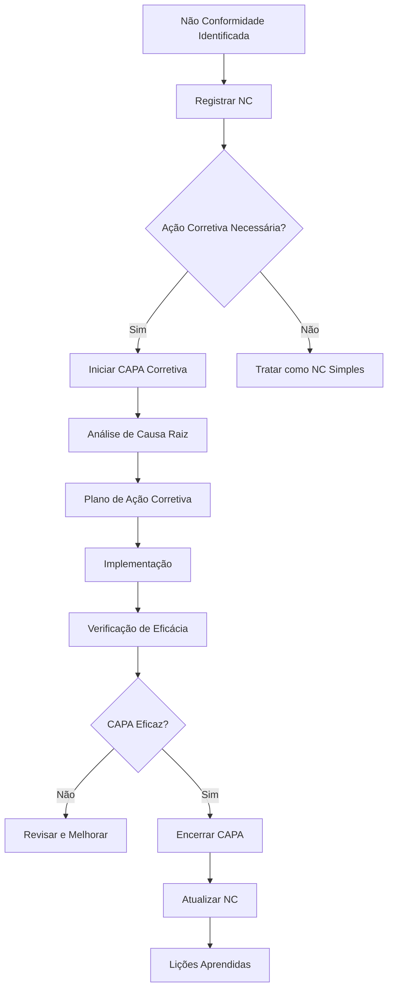

# 🔧 CAPA - Ações Corretivas e Preventivas - AlphaClinic QMS

## Visão Geral

O sistema CAPA (Corrective and Preventive Actions) do AlphaClinic QMS oferece gestão estruturada de ações corretivas e preventivas, garantindo tratamento eficaz de problemas e prevenção de recorrências conforme requisitos da ISO 9001 e RDC ANVISA.

## 📋 Estrutura do CAPA

### Ações Corretivas
- **Objetivo**: Corrigir causa raiz de problemas existentes
- **Base**: Não conformidades identificadas
- **Foco**: Solução definitiva do problema
- **Prazo**: Conforme gravidade (24h a 30 dias)

### Ações Preventivas
- **Objetivo**: Prevenir ocorrência de problemas potenciais
- **Base**: Análise de riscos e tendências
- **Foco**: Prevenção proativa
- **Prazo**: Médio/longo prazo (15 a 90 dias)

## 🚀 Processo CAPA Completo

### 1. Iniciação do CAPA

#### Critérios de Iniciação
```javascript
const capaInitiationCriteria = {
  "corrective_action": {
    "triggers": [
      "Non-conformity identified",
      "Customer complaint",
      "Audit finding",
      "Process failure",
      "Safety incident"
    ],
    "thresholds": {
      "critical": "Always requires CAPA",
      "major": "Usually requires CAPA",
      "minor": "May require CAPA based on risk"
    }
  },
  "preventive_action": {
    "triggers": [
      "Risk analysis",
      "Trend identification",
      "Process improvement opportunity",
      "Regulatory change anticipation",
      "Customer feedback"
    ],
    "thresholds": {
      "high_risk": "Always requires preventive action",
      "medium_risk": "Consider preventive action",
      "low_risk": "Monitor and evaluate"
    }
  }
};
```

### 2. Análise e Planejamento

#### Análise de Causa Raiz
```javascript
const rootCauseAnalysis = {
  "problem_statement": "Infecção hospitalar recorrente no Centro Cirúrgico",
  "data_collection": {
    "period": "Últimos 6 meses",
    "incidents": 12,
    "affected_patients": 8,
    "common_factors": ["Higienização inadequada", "Treinamento insuficiente"]
  },
  "analysis_methods": [
    "5 Whys",
    "Ishikawa Diagram",
    "Pareto Analysis",
    "Statistical Analysis"
  ],
  "identified_causes": [
    {
      "cause": "Procedimento de higienização não seguido",
      "evidence": "Observações de auditoria",
      "impact": "Alto",
      "frequency": "Recorrente"
    },
    {
      "cause": "Falta de treinamento da equipe",
      "evidence": "Registros de treinamento desatualizados",
      "impact": "Médio",
      "frequency": "Constante"
    }
  ]
};
```

#### Definição do Escopo
```javascript
const capaScope = {
  "corrective_actions": [
    {
      "id": "CA-001",
      "description": "Revisar e atualizar procedimento de higienização",
      "responsible": "Comissão de Controle de Infecção",
      "deadline": "2024-12-15",
      "resources": ["Tempo da comissão", "Dados de auditoria"],
      "success_criteria": "Procedimento aprovado e implementado"
    },
    {
      "id": "CA-002",
      "description": "Realizar treinamento de toda equipe",
      "responsible": "Enfermeiro Chefe",
      "deadline": "2024-12-10",
      "resources": ["Instrutor", "Material didático", "Sala de treinamento"],
      "success_criteria": "100% da equipe treinada e avaliada"
    }
  ],
  "preventive_actions": [
    {
      "id": "PA-001",
      "description": "Implementar auditorias mensais de higienização",
      "responsible": "Equipe da Qualidade",
      "deadline": "2024-12-31",
      "resources": ["Checklists", "Auditores treinados"],
      "success_criteria": "Auditorias mensais realizadas regularmente"
    },
    {
      "id": "PA-002",
      "description": "Desenvolver sistema de monitoramento contínuo",
      "responsible": "TI + Qualidade",
      "deadline": "2025-01-31",
      "resources": ["Software de monitoramento", "Sensores"],
      "success_criteria": "Sistema implementado e gerando alertas"
    }
  ]
};
```

### 3. Implementação

#### Plano de Implementação
```javascript
const implementationPlan = {
  "phases": [
    {
      "phase": "Preparation",
      "duration_days": 5,
      "activities": [
        "Reunir recursos necessários",
        "Comunicar stakeholders",
        "Preparar materiais",
        "Agendar atividades"
      ],
      "milestones": [
        "Recursos disponíveis",
        "Stakeholders informados",
        "Materiais prontos"
      ]
    },
    {
      "phase": "Execution",
      "duration_days": 15,
      "activities": [
        "Executar ações planejadas",
        "Monitorar progresso",
        "Ajustar conforme necessário",
        "Documentar resultados"
      ],
      "milestones": [
        "Ações iniciadas",
        "50% concluído",
        "Ações finalizadas"
      ]
    },
    {
      "phase": "Verification",
      "duration_days": 10,
      "activities": [
        "Verificar implementação",
        "Avaliar eficácia",
        "Coletar evidências",
        "Preparar relatório"
      ],
      "milestones": [
        "Verificação concluída",
        "Eficácia confirmada",
        "Relatório aprovado"
      ]
    }
  ],
  "risks": [
    {
      "risk": "Resistência da equipe",
      "probability": "Medium",
      "impact": "High",
      "mitigation": "Comunicar benefícios e envolver equipe no planejamento"
    },
    {
      "risk": "Recursos insuficientes",
      "probability": "Low",
      "impact": "High",
      "mitigation": "Garantir aprovação prévia de recursos necessários"
    }
  ]
};
```

## 📊 Monitoramento e Controle

### Indicadores de Performance

#### KPIs de CAPA
```javascript
const capaKPIs = {
  "effectiveness": {
    "description": "Porcentagem de CAPAs eficazes",
    "target": ">95%",
    "calculation": "(CAPAs eficazes / Total de CAPAs) * 100",
    "frequency": "Mensal"
  },
  "timeliness": {
    "description": "CAPAs concluídas dentro do prazo",
    "target": ">90%",
    "calculation": "(CAPAs on-time / Total de CAPAs) * 100",
    "frequency": "Mensal"
  },
  "efficiency": {
    "description": "Tempo médio de conclusão",
    "target": "<30 dias",
    "calculation": "Média de dias para conclusão",
    "frequency": "Mensal"
  },
  "recurrence": {
    "description": "Problemas recorrentes após CAPA",
    "target": "<5%",
    "calculation": "(Problemas recorrentes / Total de CAPAs) * 100",
    "frequency": "Trimestral"
  }
};
```

### Dashboards de Acompanhamento

#### Visão Geral do CAPA
```html
<!-- Dashboard CAPA -->
<div class="capa-dashboard">
  <div class="kpi-summary">
    <div class="kpi-card">
      <h3>CAPAs Abertas</h3>
      <span class="number">12</span>
      <div class="progress-bar">
        <div class="progress" style="width: 75%"></div>
      </div>
    </div>
    <div class="kpi-card">
      <h3>Eficácia Média</h3>
      <span class="number">94%</span>
      <span class="trend up">+2% vs mês anterior</span>
    </div>
    <div class="kpi-card">
      <h3>Tempo Médio</h3>
      <span class="number">18 dias</span>
      <span class="trend down">-3 dias vs mês anterior</span>
    </div>
  </div>

  <div class="charts-section">
    <div class="chart-container">
      <!-- Gráfico de status das CAPAs -->
    </div>
    <div class="chart-container">
      <!-- Gráfico de tempo de conclusão -->
    </div>
  </div>

  <div class="recent-capas">
    <!-- Lista de CAPAs recentes -->
  </div>
</div>
```

## 🔍 Verificação de Eficácia

### Processo de Verificação

#### Métodos de Verificação
```javascript
const verificationMethods = {
  "document_review": {
    "description": "Análise de documentos e registros",
    "applicable_to": ["Procedural changes", "Training records"],
    "evidence_required": ["Updated documents", "Training certificates"]
  },
  "field_observation": {
    "description": "Observação direta da implementação",
    "applicable_to": ["Process changes", "Behavioral changes"],
    "evidence_required": ["Observation checklist", "Photos/videos"]
  },
  "data_analysis": {
    "description": "Análise de dados e indicadores",
    "applicable_to": ["Performance improvements", "Error reductions"],
    "evidence_required": ["Before/after data", "Statistical analysis"]
  },
  "stakeholder_feedback": {
    "description": "Feedback de envolvidos e afetados",
    "applicable_to": ["All types of CAPA"],
    "evidence_required": ["Survey results", "Interview notes"]
  }
};
```

#### Critérios de Eficácia
```javascript
const effectivenessCriteria = {
  "problem_resolution": {
    "description": "Problema original foi resolvido",
    "measurement": "Não ocorrência do problema",
    "target": "Zero recorrências por 6 meses"
  },
  "process_improvement": {
    "description": "Processo foi melhorado",
    "measurement": "Indicadores de processo melhorados",
    "target": "Melhoria de pelo menos 20%"
  },
  "knowledge_transfer": {
    "description": "Conhecimento foi disseminado",
    "measurement": "Equipe demonstra compreensão",
    "target": "100% da equipe treinada"
  },
  "systemic_change": {
    "description": "Mudança sustentável implementada",
    "measurement": "Controles permanentes estabelecidos",
    "target": "Controles documentados e auditáveis"
  }
};
```

## 📋 Documentação e Registros

### Registros Obrigatórios

#### Documentos do CAPA
```javascript
const capaRecords = {
  "initiation_record": {
    "fields": [
      "CAPA number",
      "Title",
      "Description",
      "Source (NC, audit, etc.)",
      "Initiated by",
      "Initiation date",
      "Classification (corrective/preventive)",
      "Priority"
    ],
    "retention": "Permanent"
  },
  "investigation_record": {
    "fields": [
      "Root cause analysis",
      "Risk assessment",
      "Scope definition",
      "Team assignment",
      "Timeline",
      "Resources required"
    ],
    "retention": "7 years"
  },
  "action_plan": {
    "fields": [
      "Detailed action steps",
      "Responsible parties",
      "Deadlines",
      "Resources",
      "Success criteria",
      "Verification methods"
    ],
    "retention": "7 years"
  },
  "verification_record": {
    "fields": [
      "Verification activities",
      "Results",
      "Effectiveness assessment",
      "Follow-up requirements",
      "Closure approval"
    ],
    "retention": "7 years"
  }
};
```

## 🔧 Integração com Outros Módulos

### Relacionamento com NCs

#### Fluxo Integrado


### Integração com Auditorias

#### Uso em Auditorias
- 📋 **Entrada**: Achados de auditoria disparam CAPAs
- 🔍 **Verificação**: Auditorias verificam implementação de CAPAs
- 📊 **Evidência**: CAPAs servem como evidência de melhoria
- 📈 **Monitoramento**: Auditorias acompanham eficácia de CAPAs

## 📱 Interface do Usuário

### Módulo CAPA

#### Tela Principal
```html
<!-- Interface principal do CAPA -->
<div class="capa-module">
  <div class="capa-header">
    <h2>CAPAs - Ações Corretivas e Preventivas</h2>
    <div class="capa-actions">
      <button onclick="newCAPA()">Nova CAPA</button>
      <button onclick="capaReports()">Relatórios</button>
    </div>
  </div>

  <div class="capa-filters">
    <select id="capa-type">
      <option value="all">Todas</option>
      <option value="corrective">Corretivas</option>
      <option value="preventive">Preventivas</option>
    </select>
    <select id="capa-status">
      <option value="all">Todos Status</option>
      <option value="open">Abertas</option>
      <option value="in_progress">Em Andamento</option>
      <option value="closed">Encerradas</option>
    </select>
  </div>

  <div class="capa-list">
    <!-- Lista de CAPAs -->
  </div>
</div>
```

### Formulário de CAPA

#### Criação de Nova CAPA
```html
<!-- Formulário de CAPA -->
<form class="capa-form">
  <div class="form-section">
    <h3>Informações Gerais</h3>
    <div class="form-row">
      <div class="form-group">
        <label>Título da CAPA:</label>
        <input type="text" name="title" required>
      </div>
      <div class="form-group">
        <label>Tipo:</label>
        <select name="type" required>
          <option value="corrective">Corretiva</option>
          <option value="preventive">Preventiva</option>
        </select>
      </div>
    </div>
    <div class="form-group">
      <label>Descrição do Problema/Oportunidade:</label>
      <textarea name="description" rows="4" required></textarea>
    </div>
  </div>

  <div class="form-section">
    <h3>Análise de Causa Raiz</h3>
    <div class="form-group">
      <label>Método de Análise:</label>
      <select name="analysis_method">
        <option value="5_whys">5 Porquês</option>
        <option value="ishikawa">Diagrama de Ishikawa</option>
        <option value="pareto">Análise de Pareto</option>
      </select>
    </div>
    <div class="form-group">
      <label>Análise Detalhada:</label>
      <textarea name="root_cause_analysis" rows="6"></textarea>
    </div>
  </div>

  <div class="form-section">
    <h3>Plano de Ação</h3>
    <div class="actions-container">
      <!-- Ações serão adicionadas dinamicamente -->
    </div>
    <button type="button" onclick="addAction()">Adicionar Ação</button>
  </div>

  <div class="form-actions">
    <button type="button" onclick="saveDraft()">Salvar Rascunho</button>
    <button type="submit">Iniciar CAPA</button>
  </div>
</form>
```

## 🔧 APIs do CAPA

### Endpoints Principais

#### Gerenciamento de CAPAs
```bash
# Criar nova CAPA
POST /api/v1/capa
{
  "title": "Prevenir Infecções Hospitalares",
  "type": "preventive",
  "description": "Implementar medidas preventivas contra infecções",
  "priority": "high",
  "source_nc_id": 123,
  "team": [1, 2, 3]
}

# Listar CAPAs
GET /api/v1/capa?status=open&type=corrective&priority=high

# Obter CAPA específica
GET /api/v1/capa/{id}
```

#### Análise de Causa Raiz
```bash
# Registrar análise de causa raiz
POST /api/v1/capa/{id}/root-cause-analysis
{
  "method": "5_whys",
  "analysis": {
    "problem": "Infecção hospitalar recorrente",
    "whys": ["Procedimento não seguido", "Treinamento inadequado"],
    "root_cause": "Sistema de treinamento inadequado"
  },
  "analyst": "Maria Santos",
  "evidence": ["Dados de auditoria", "Registros de treinamento"]
}
```

#### Plano de Ação
```bash
# Adicionar ação ao CAPA
POST /api/v1/capa/{id}/actions
{
  "description": "Implementar treinamento online",
  "type": "corrective",
  "responsible_user": 5,
  "deadline": "2024-12-15T17:00:00Z",
  "resources": ["Plataforma EAD", "Conteúdo"],
  "success_criteria": "Sistema implementado"
}
```

## 🎯 Melhores Práticas

### Para Implementação de CAPA
- ✅ Foque na causa raiz, não nos sintomas
- ✅ Seja específico nas ações planejadas
- ✅ Estabeleça critérios claros de sucesso
- ✅ Monitore progresso regularmente
- ✅ Verifique eficácia antes de encerrar

### Para Gestão de CAPA
- ✅ Mantenha processo simples e objetivo
- ✅ Treine equipe regularmente
- ✅ Use dados para melhoria contínua
- ✅ Integre com outros processos de qualidade
- ✅ Celebre sucessos e aprenda com falhas

### Para Verificação de Eficácia
- ✅ Estabeleça métricas claras
- ✅ Monitore por período adequado
- ✅ Use métodos apropriados de verificação
- ✅ Documente resultados adequadamente
- ✅ Tome ações quando eficácia não atingida

## 📞 Suporte e Troubleshooting

### Problemas Comuns

#### CAPAs Ineficazes
```bash
# Análise de CAPAs ineficazes
flask analyze-ineffective-capas --period 6months

# Identificar causas comuns
flask identify-capa-failure-patterns

# Melhorar processo
flask improve-capa-process --based-on-analysis
```

#### Atraso na Implementação
```bash
# Identificar CAPAs atrasadas
flask find-overdue-capas --days 15

# Plano de aceleração
flask create-catchup-plan --capa-id 123

# Notificar responsáveis
flask escalate-overdue-capas
```

#### Falta de Recursos
```bash
# Análise de recursos necessários
flask analyze-resource-needs --pending-capas

# Otimizar alocação
flask optimize-resource-allocation

# Solicitar recursos adicionais
flask request-additional-resources --justification "Baseado em análise de CAPAs"
```

---

**Última atualização:** Dezembro 2024
**Versão:** 1.0.0