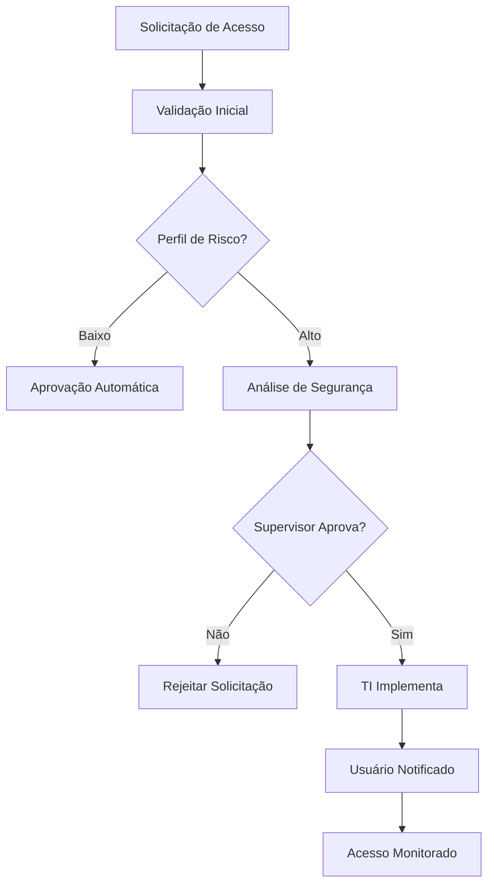

# 👥 Gestão de Usuários e Equipes - AlphaClinic QMS

## Visão Geral

O sistema de gestão de usuários e equipes do AlphaClinic QMS oferece controle completo de acesso, permissões e colaboração, garantindo segurança da informação e eficiência operacional em ambientes clínicos com requisitos rigorosos de conformidade.

## 👤 Gestão de Usuários

### Cadastro de Usuários

#### Processo de Cadastro
```javascript
const userRegistration = {
  "basic_info": {
    "username": "joao.silva",
    "email": "joao.silva@alphaclin.com",
    "full_name": "João Silva Santos",
    "cpf": "123.456.789-00",
    "phone": "+55 11 99999-9999",
    "birth_date": "1985-03-15",
    "registration_number": "CRM-SP 123456" // Para médicos
  },
  "professional_info": {
    "role": "enfermeiro_chefe",
    "department": "Centro Cirúrgico",
    "specialty": "Enfermagem Cirúrgica",
    "registration_coren": "123456-SP", // Para enfermeiros
    "admission_date": "2020-01-15",
    "work_regime": "CLT",
    "workload": "40 horas semanais"
  },
  "access_info": {
    "require_password_change": true,
    "two_factor_enabled": true,
    "access_level": "standard",
    "temporary_access": false,
    "access_expiry": null
  }
};
```

### Perfis de Usuário

#### Tipos de Perfil
```javascript
const userProfiles = {
  "admin": {
    "description": "Administrador completo do sistema",
    "permissions": [
      "system_admin",
      "user_management",
      "audit_all",
      "configure_system",
      "manage_backups"
    ],
    "access_level": "total",
    "requires_approval": false
  },
  "manager": {
    "description": "Gestor de área/departamento",
    "permissions": [
      "manage_team",
      "approve_documents",
      "view_reports",
      "manage_processes"
    ],
    "access_level": "department",
    "requires_approval": true
  },
  "user": {
    "description": "Usuário padrão do sistema",
    "permissions": [
      "create_documents",
      "participate_workflows",
      "view_own_data",
      "use_system_features"
    ],
    "access_level": "standard",
    "requires_approval": true
  },
  "auditor": {
    "description": "Auditor interno/externo",
    "permissions": [
      "conduct_audits",
      "view_all_documents",
      "access_audit_trail",
      "generate_reports"
    ],
    "access_level": "read_only",
    "requires_approval": true
  }
};
```

### Autenticação e Segurança

#### Métodos de Autenticação
```javascript
const authenticationMethods = {
  "password": {
    "requirements": {
      "min_length": 12,
      "require_uppercase": true,
      "require_lowercase": true,
      "require_numbers": true,
      "require_symbols": true,
      "prevent_reuse": true,
      "max_age_days": 90
    },
    "failed_attempts": {
      "max_attempts": 5,
      "lockout_duration_minutes": 30,
      "notification_on_lockout": true
    }
  },
  "two_factor": {
    "methods": ["app", "sms", "email"],
    "required_for_roles": ["admin", "manager"],
    "backup_codes": true,
    "remember_device": true
  },
  "certificate": {
    "supported_types": ["A1", "A3"],
    "auto_renewal": false,
    "validation_required": true
  }
};
```

## 👥 Gestão de Equipes

### Estrutura de Equipes

#### Tipos de Equipe
```javascript
const teamTypes = {
  "permanent": {
    "description": "Equipe fixa com estrutura definida",
    "examples": ["Centro Cirúrgico", "Enfermagem", "Qualidade"],
    "management": "Hierárquica",
    "stability": "Alto"
  },
  "project": {
    "description": "Equipe temporária para projeto específico",
    "examples": ["Implementação PEP", "Auditoria Especial"],
    "management": "Matricial",
    "stability": "Médio"
  },
  "committee": {
    "description": "Comitê para decisões específicas",
    "examples": ["CIPA", "Controle de Infecção", "Qualidade"],
    "management": "Colaborativa",
    "stability": "Alto"
  }
};
```

### Criação e Configuração de Equipes

#### Processo de Criação
```javascript
const teamCreation = {
  "basic_info": {
    "name": "Centro Cirúrgico",
    "code": "CC-001",
    "type": "permanent",
    "description": "Equipe responsável pelo centro cirúrgico",
    "parent_team": "Assistencial",
    "manager": "Dr. Roberto Santos",
    "creation_date": "2024-01-01",
    "status": "active"
  },
  "membership": {
    "leaders": [
      {
        "user_id": 1,
        "role": "Coordenador",
        "appointment_date": "2024-01-01",
        "term_end": null
      }
    ],
    "members": [
      {
        "user_id": 2,
        "role": "Enfermeiro Chefe",
        "appointment_date": "2024-01-01",
        "term_end": null
      },
      {
        "user_id": 3,
        "role": "Técnico de Enfermagem",
        "appointment_date": "2024-02-01",
        "term_end": null
      }
    ]
  },
  "settings": {
    "visibility": "department",
    "allow_self_join": false,
    "require_approval": true,
    "notification_preferences": {
      "email_notifications": true,
      "team_updates": true,
      "document_sharing": true
    }
  }
};
```

## 🔐 Sistema de Permissões

### Modelo de Permissões

#### Hierarquia de Permissões
```javascript
const permissionHierarchy = {
  "system_level": {
    "admin": {
      "description": "Controle total do sistema",
      "scope": "all_resources",
      "actions": ["create", "read", "update", "delete", "manage"]
    }
  },
  "organization_level": {
    "manager": {
      "description": "Gestão organizacional",
      "scope": "organization_resources",
      "actions": ["create", "read", "update", "delete", "approve"]
    }
  },
  "department_level": {
    "supervisor": {
      "description": "Supervisão departamental",
      "scope": "department_resources",
      "actions": ["create", "read", "update", "approve"]
    }
  },
  "team_level": {
    "team_lead": {
      "description": "Liderança de equipe",
      "scope": "team_resources",
      "actions": ["create", "read", "update"]
    }
  },
  "user_level": {
    "user": {
      "description": "Acesso básico",
      "scope": "own_resources",
      "actions": ["read", "update_own"]
    }
  }
};
```

### Controle de Acesso Baseado em Função (RBAC)

#### Definição de Roles
```javascript
const roleDefinitions = {
  "document_manager": {
    "description": "Gestor de documentos",
    "permissions": [
      "document.create",
      "document.edit",
      "document.approve",
      "document.archive",
      "workflow.manage"
    ],
    "scope": "department",
    "assignment_rules": {
      "auto_assign": false,
      "requires_approval": true,
      "review_period_months": 12
    }
  },
  "quality_auditor": {
    "description": "Auditor da qualidade",
    "permissions": [
      "audit.conduct",
      "audit.view_all",
      "nc.create",
      "nc.investigate",
      "report.generate"
    ],
    "scope": "organization",
    "assignment_rules": {
      "auto_assign": false,
      "requires_approval": true,
      "review_period_months": 12
    }
  },
  "process_owner": {
    "description": "Proprietário de processo",
    "permissions": [
      "process.edit",
      "process.monitor",
      "improvement.initiate",
      "team.coordinate"
    ],
    "scope": "specific_processes",
    "assignment_rules": {
      "auto_assign": true,
      "requires_approval": false,
      "review_period_months": 6
    }
  }
};
```

## 📋 Gestão de Acesso Temporário

### Acesso Temporário

#### Tipos de Acesso Temporário
```javascript
const temporaryAccess = {
  "consultant": {
    "description": "Consultor externo com acesso limitado",
    "duration_days": 30,
    "permissions": ["read_only"],
    "scope": "specific_projects",
    "approval_required": true,
    "supervisor_required": true
  },
  "temporary_worker": {
    "description": "Funcionário temporário",
    "duration_days": 90,
    "permissions": ["standard_user"],
    "scope": "assigned_department",
    "approval_required": true,
    "supervisor_required": true
  },
  "auditor": {
    "description": "Auditor externo",
    "duration_days": 15,
    "permissions": ["audit_access"],
    "scope": "audit_scope",
    "approval_required": true,
    "supervisor_required": false
  }
};
```

### Processo de Solicitação

#### Workflow de Aprovação


## 📊 Relatórios e Auditoria

### Relatórios de Acesso

#### Relatório de Atividades de Usuário
```bash
# Relatório de atividades por usuário
GET /api/v1/reports/user-activity?user_id=123&period=2024-12

# Resposta
{
  "user_id": 123,
  "period": "2024-12-01 to 2024-12-31",
  "summary": {
    "total_logins": 45,
    "total_actions": 1250,
    "average_session_time": "2h 15m",
    "last_login": "2024-12-31T17:30:00Z"
  },
  "activity_by_type": {
    "document_access": 450,
    "system_configuration": 25,
    "user_management": 15,
    "report_generation": 30
  },
  "security_events": [
    {
      "type": "failed_login",
      "timestamp": "2024-12-15T10:30:00Z",
      "ip_address": "192.168.1.100",
      "details": "Tentativa de login com senha incorreta"
    }
  ]
}
```

#### Relatório de Acesso por Recurso
```bash
# Acesso a documentos específicos
GET /api/v1/reports/resource-access?resource_type=document&period=2024-12

# Resposta
{
  "resource_type": "document",
  "period": "2024-12-01 to 2024-12-31",
  "top_accessed": [
    {
      "document_id": 123,
      "title": "Procedimento de Higienização",
      "access_count": 150,
      "unique_users": 45,
      "departments": ["Centro Cirúrgico", "Enfermagem"]
    }
  ],
  "access_by_time": {
    "08:00-12:00": 45,
    "12:00-18:00": 75,
    "18:00-22:00": 30
  }
}
```

### Auditoria de Segurança

#### Trilha de Auditoria Completa
```javascript
const auditTrail = {
  "event_id": "audit_20241201_001",
  "timestamp": "2024-12-01T10:30:00Z",
  "user": {
    "user_id": 123,
    "username": "joao.silva",
    "role": "enfermeiro_chefe",
    "department": "Centro Cirúrgico"
  },
  "action": {
    "type": "document_access",
    "description": "Visualização de documento",
    "resource": {
      "type": "document",
      "id": 456,
      "title": "Procedimento de Higienização"
    }
  },
  "context": {
    "ip_address": "192.168.1.100",
    "user_agent": "Mozilla/5.0 (Windows NT 10.0; Win64; x64) AppleWebKit/537.36",
    "session_id": "sess_abc123def456",
    "location": "São Paulo, SP"
  },
  "result": {
    "success": true,
    "http_status": 200,
    "response_time_ms": 150
  }
};
```

## 📱 Interface do Usuário

### Gestão de Usuários

#### Lista de Usuários
```html
<!-- Interface de gestão de usuários -->
<div class="users-management">
  <div class="users-header">
    <h2>Gestão de Usuários</h2>
    <div class="users-actions">
      <button onclick="newUser()">Novo Usuário</button>
      <button onclick="importUsers()">Importar Usuários</button>
      <button onclick="userReports()">Relatórios</button>
    </div>
  </div>

  <div class="users-filters">
    <select id="department-filter">
      <option value="">Todos os Departamentos</option>
      <option value="centro_cirurgico">Centro Cirúrgico</option>
      <option value="enfermagem">Enfermagem</option>
    </select>
    <select id="role-filter">
      <option value="">Todas as Funções</option>
      <option value="admin">Administrador</option>
      <option value="manager">Gestor</option>
    </select>
    <input type="text" id="search-users" placeholder="Buscar usuários...">
  </div>

  <div class="users-table">
    <table>
      <thead>
        <tr>
          <th>Nome</th>
          <th>Usuário</th>
          <th>Função</th>
          <th>Departamento</th>
          <th>Status</th>
          <th>Último Acesso</th>
          <th>Ações</th>
        </tr>
      </thead>
      <tbody>
        <tr>
          <td>João Silva Santos</td>
          <td>joao.silva</td>
          <td>Enfermeiro Chefe</td>
          <td>Centro Cirúrgico</td>
          <td><span class="status active">Ativo</span></td>
          <td>2024-12-01 10:30</td>
          <td>
            <button onclick="editUser()">Editar</button>
            <button onclick="resetPassword()">Resetar Senha</button>
            <button onclick="managePermissions()">Permissões</button>
          </td>
        </tr>
      </tbody>
    </table>
  </div>
</div>
```

### Gestão de Equipes

#### Organograma de Equipes
```html
<!-- Interface de gestão de equipes -->
<div class="teams-management">
  <div class="teams-header">
    <h2>Gestão de Equipes</h2>
    <div class="teams-actions">
      <button onclick="newTeam()">Nova Equipe</button>
      <button onclick="teamAnalytics()">Analytics</button>
    </div>
  </div>

  <div class="org-chart">
    <!-- Organograma visual das equipes -->
  </div>

  <div class="teams-list">
    <div class="team-card">
      <div class="team-header">
        <h3>Centro Cirúrgico</h3>
        <span class="team-code">CC-001</span>
      </div>
      <div class="team-info">
        <div class="team-members">
          <span class="member-count">15 membros</span>
        </div>
        <div class="team-leader">
          <strong>Líder:</strong> Dr. Roberto Santos
        </div>
      </div>
      <div class="team-actions">
        <button onclick="viewTeam()">Ver Equipe</button>
        <button onclick="editTeam()">Editar</button>
        <button onclick="manageMembers()">Gerenciar Membros</button>
      </div>
    </div>
  </div>
</div>
```

## 🔧 APIs de Gestão de Usuários e Equipes

### Endpoints de Usuários

#### Gerenciamento de Usuários
```bash
# Criar novo usuário
POST /api/v1/users
{
  "username": "joao.silva",
  "email": "joao.silva@alphaclin.com",
  "full_name": "João Silva Santos",
  "role": "enfermeiro_chefe",
  "department": "Centro Cirúrgico",
  "require_password_change": true,
  "two_factor_enabled": true
}

# Atualizar permissões de usuário
PATCH /api/v1/users/{user_id}/permissions
{
  "add_permissions": ["document.approve", "audit.view"],
  "remove_permissions": ["admin.access"],
  "reason": "Promoção para Enfermeiro Chefe"
}
```

#### Autenticação e Sessão
```bash
# Login
POST /api/v1/auth/login
{
  "username": "joao.silva",
  "password": "senha_segura",
  "two_factor_code": "123456" // Se habilitado
}

# Verificar sessão
GET /api/v1/auth/session

# Logout
POST /api/v1/auth/logout
```

### Endpoints de Equipes

#### Gerenciamento de Equipes
```bash
# Criar nova equipe
POST /api/v1/teams
{
  "name": "Centro Cirúrgico",
  "code": "CC-001",
  "type": "permanent",
  "manager_id": 1,
  "parent_team_id": 2,
  "settings": {
    "visibility": "department",
    "require_approval": true
  }
}

# Adicionar membro à equipe
POST /api/v1/teams/{team_id}/members
{
  "user_id": 123,
  "role": "Enfermeiro Chefe",
  "start_date": "2024-12-01",
  "is_leader": false
}
```

## 🎯 Melhores Práticas

### Para Gestão de Usuários
- ✅ Mantenha informações de usuário sempre atualizadas
- ✅ Revise permissões regularmente
- ✅ Desabilite usuários inativos prontamente
- ✅ Use autenticação de dois fatores para usuários críticos
- ✅ Monitore atividades suspeitas

### Para Gestão de Equipes
- ✅ Mantenha organograma atualizado
- ✅ Defina líderes claros para cada equipe
- ✅ Estabeleça processos de comunicação claros
- ✅ Revise composição de equipes periodicamente
- ✅ Documente responsabilidades de cada equipe

### Para Segurança
- ✅ Implemente princípio do menor privilégio
- ✅ Monitore trilha de auditoria regularmente
- ✅ Use acesso temporário para casos especiais
- ✅ Mantenha backups de configurações de segurança
- ✅ Treine usuários em boas práticas de segurança

## 📞 Suporte e Troubleshooting

### Problemas Comuns

#### Acesso Negado
```bash
# Verificar permissões do usuário
flask check-user-permissions --user-id 123 --resource document --action edit

# Corrigir permissões
flask fix-user-permissions --user-id 123 --add-permissions "document.edit"
```

#### Usuário Bloqueado
```bash
# Verificar status do usuário
flask check-user-status --user-id 123

# Desbloquear usuário
flask unlock-user --user-id 123 --reason "Bloqueio acidental"

# Resetar tentativas de login
flask reset-login-attempts --user-id 123
```

#### Problemas de Performance
```bash
# Otimizar consultas de usuário
flask optimize-user-queries --strategy "caching,indexing"

# Limpar sessões antigas
flask cleanup-old-sessions --older-than-days 30
```

---

**Última atualização:** Dezembro 2024
**Versão:** 1.0.0