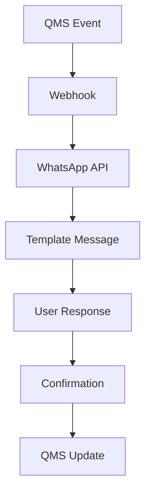
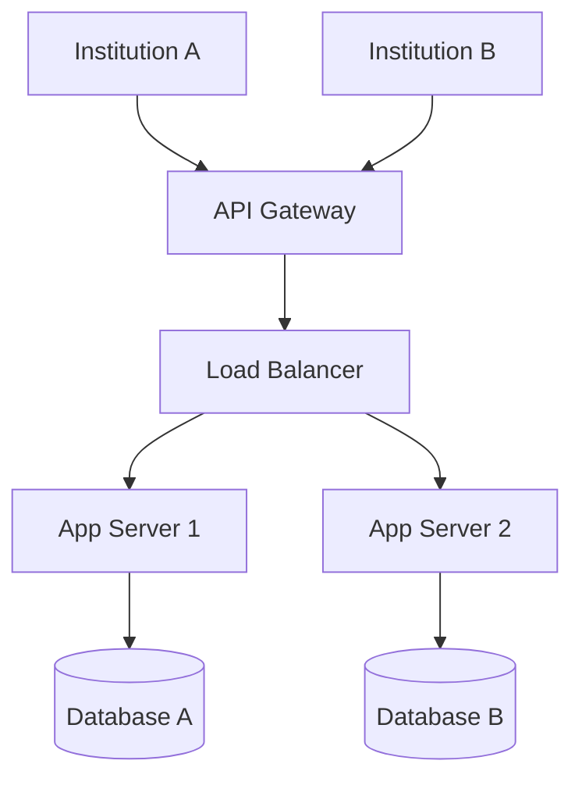

# 🗺️ Roadmap - Alphaclin QMS

Este documento apresenta o **plano de desenvolvimento** do Alphaclin QMS, com funcionalidades já implementadas, em desenvolvimento e planejadas para o futuro.

## 📊 Status Atual (v1.0.0)

### ✅ **100% Implementado**

#### Core QMS
- ✅ **Dashboard** com métricas dinâmicas
- ✅ **Gestão Documental** completa (workflow, versões, assinaturas)
- ✅ **Auditorias** (internas/externas) com NCs
- ✅ **CAPA** estruturado (5W2H, workflow completo)
- ✅ **Assinaturas Eletrônicas** válidas (SHA-256)

#### Operacional
- ✅ **CIPA** - Gestão de reuniões e atas
- ✅ **PDCA** - Ciclos de melhoria contínua
- ✅ **Kanban** - Quadro visual de tarefas
- ✅ **Notificações** por e-mail automáticas

#### Sistema
- ✅ **Usuários e Equipes** com permissões
- ✅ **Relatórios** automatizados
- ✅ **APIs REST** completas
- ✅ **PostgreSQL** support
- ✅ **Instalação automática**

## 🚀 Próximas Versões

### 🔄 **Em Desenvolvimento (v1.1.0 - Q1 2025)**

#### 📱 Mobile & PWA
- **Progressive Web App** (PWA)
- **Interface responsiva** aprimorada
- **Offline capabilities** básicas
- **Push notifications** web

#### 💬 WhatsApp Business API
- **Integração oficial** WhatsApp Business
- **Templates** de mensagem aprovados
- **Confirmação de leitura** via WhatsApp
- **Histórico** de conversas

#### 📊 BI & Analytics Básico
- **Dashboards customizáveis**
- **Gráficos interativos** (Chart.js)
- **Exportação** avançada (PDF/Excel)
- **Relatórios agendados**

### 🎯 **Planejado (v1.2.0 - Q2 2025)**

#### 🤖 Inteligência Artificial
- **Análise de risco** preditiva
- **Classificação automática** de documentos
- **Sugestões** de melhorias
- **Chatbot** para suporte

#### 🔗 Integrações Avançadas
- **HL7 FHIR** para HIS/LIS
- **SAP/ERP** conectores
- **LDAP/AD** avançado
- **Webhooks** bidirecionais

#### 📈 Analytics Avançado
- **Machine Learning** para tendências
- **Predição** de NCs
- **Análise de conformidade**
- **Benchmarking** setorial

### 🌟 **Visão Long-term (v2.0.0 - 2025)**

#### 📱 Mobile App Nativa
- **iOS/Android** nativo
- **Leitura offline** completa
- **Assinaturas digitais** mobile
- **Câmera** para documentos

#### ☁️ Cloud & Multi-tenant
- **SaaS** multi-instituição
- **Auto-scaling** automático
- **Backup** geograficamente distribuído
- **Compliance** internacional

#### 🔍 IA Avançada
- **Processamento de linguagem natural**
- **Análise de imagens** (OCR avançado)
- **Reconhecimento de padrões**
- **Automação inteligente**

## 📋 Funcionalidades Detalhadas

### 📱 Mobile & PWA (v1.1.0)

#### Progressive Web App
```javascript
// Service Worker para offline
self.addEventListener('install', (event) => {
  event.waitUntil(
    caches.open('alphaclin-v1').then((cache) => {
      return cache.addAll([
        '/',
        '/static/css/app.css',
        '/static/js/app.js',
        '/manifest.json'
      ]);
    })
  );
});

// Push notifications
self.addEventListener('push', (event) => {
  const options = {
    body: event.data.text(),
    icon: '/static/img/icon-192x192.png',
    badge: '/static/img/badge-72x72.png'
  };
  event.waitUntil(
    self.registration.showNotification('Alphaclin QMS', options)
  );
});
```

#### Recursos PWA
- **Instalável** no desktop/mobile
- **Offline-first** para documentos críticos
- **Sincronização** automática quando online
- **Push notifications** nativas

### 💬 WhatsApp Integration (v1.1.0)

#### Arquitetura


#### Templates Aprovados
- **Documento Aprovado**: "Seu documento {{titulo}} foi aprovado ✅"
- **CAPA Criado**: "Novo plano CAPA atribuído: {{titulo}}"
- **NC Registrada**: "NC crítica identificada: {{titulo}}"
- **Reunião CIPA**: "Lembrete: Reunião CIPA amanhã às {{hora}}"

### 📊 BI & Analytics (v1.1.0)

#### Dashboards Customizáveis
```json
{
  "dashboard": {
    "id": "compliance-overview",
    "title": "Visão Geral de Conformidade",
    "widgets": [
      {
        "type": "kpi",
        "metric": "document_approval_rate",
        "title": "Taxa de Aprovação",
        "target": 95
      },
      {
        "type": "chart",
        "metric": "nc_resolution_time",
        "chart_type": "line",
        "period": "6months"
      }
    ]
  }
}
```

#### Métricas Avançadas
- **Predição de NCs** baseada em histórico
- **Análise de tendências** sazonais
- **Benchmarking** com instituições similares
- **Alertas inteligentes** de risco

### 🤖 IA & Machine Learning (v1.2.0)

#### Casos de Uso
- **Classificação automática** de documentos por conteúdo
- **Extração de entidades** (datas, responsáveis, normas)
- **Análise de sentimento** em auditorias
- **Predição de conformidade** baseada em padrões

#### Implementação
```python
# Classificação de documentos
from transformers import pipeline

classifier = pipeline("text-classification",
                     model="alphaclin/document-classifier")

result = classifier("Este documento descreve o procedimento de...")
# Output: {"label": "procedimento", "score": 0.95}
```

### 📱 Mobile App Nativa (v2.0.0)

#### Funcionalidades
- **Autenticação biométrica** (Face ID, Touch ID)
- **Leitura offline** com sincronização
- **Assinaturas digitais** com certificado mobile
- **Câmera integrada** para documentação
- **Notificações push** personalizáveis

#### Tecnologias
- **React Native** para cross-platform
- **SQLite** local para offline
- **JWT** para autenticação
- **WebRTC** para colaboração

### ☁️ SaaS Multi-tenant (v2.0.0)

#### Arquitetura


#### Recursos
- **Isolamento total** por instituição
- **Customização** de logo e cores
- **APIs dedicadas** por cliente
- **Backup independente**
- **Escalabilidade** automática

## 📅 Cronograma Detalhado

### Q1 2025 (v1.1.0)
- **Janeiro**: PWA e offline capabilities
- **Fevereiro**: WhatsApp Business API
- **Março**: BI básico e relatórios avançados

### Q2 2025 (v1.2.0)
- **Abril**: IA básica (classificação)
- **Maio**: Integrações HL7/SAP
- **Junho**: Analytics avançado

### Q3 2025 (v1.3.0)
- **Julho**: Mobile app beta
- **Agosto**: Machine learning avançado
- **Setembro**: Multi-tenant básico

### Q4 2025 (v2.0.0)
- **Outubro**: Mobile app v1.0
- **Novembro**: SaaS production
- **Dezembro**: Recursos enterprise

## 🎯 Métricas de Sucesso

### Usuários
- **Adoption rate**: 80% dos usuários ativos
- **Mobile usage**: 60% das interações
- **Satisfaction**: NPS > 70

### Sistema
- **Uptime**: 99.9% SLA
- **Performance**: < 2s response time
- **Security**: Zero breaches
- **Scalability**: 1000+ usuários simultâneos

### Qualidade
- **Conformidade**: 100% com normas
- **Automação**: 80% dos processos
- **Eficiência**: 50% redução no tempo de auditorias

## 💡 Inovação Contínua

### Pesquisa & Desenvolvimento
- **Blockchain** para certificação imutável
- **IoT** integração com equipamentos
- **VR/AR** para treinamentos
- **Quantum computing** para analytics

### Parcerias Estratégicas
- **Universidades** para pesquisa em IA
- **Startups** de healthtech
- **ONGs** de qualidade em saúde
- **Governo** para regulamentação

## 🤝 Contribuição Comunitária

### Open Source Components
- **SDKs** para integrações
- **Plugins** para customizações
- **Templates** compartilhados
- **Documentação** colaborativa

### Comunidade
- **Forum** de usuários
- **Webinars** mensais
- **Certificações** oficiais
- **Parcerias** com instituições

---

*Este roadmap é dinâmico e pode ser ajustado baseado no feedback dos usuários e evolução do mercado de saúde.*