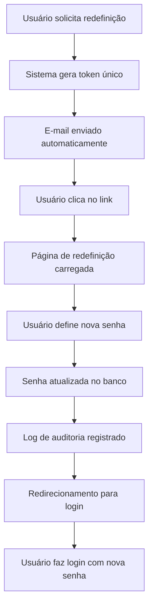

# 🔐 Redefinição de Senha - Guia Completo

## Visão Geral

Este guia explica detalhadamente como realizar a redefinição de senha no Alphaclin QMS, tanto pelo método tradicional por e-mail quanto pelas novas funcionalidades integradas ao perfil do usuário.

## 📋 Métodos Disponíveis

### Método 1: Redefinição por E-mail (Recomendado)
### Método 2: Alteração Direta no Perfil
### Método 3: Reset Administrativo (Apenas para Admins)

---

## 🔑 Método 1: Redefinição por E-mail

### Quando Usar
- **Esqueceu completamente** sua senha
- **Primeiro acesso** à conta
- **Conta bloqueada** ou com problemas
- **Política de segurança** exige renovação

### Passo a Passo Detalhado

#### Etapa 1: Solicitar Redefinição
1. **Acesse a página de login**
   ```
   http://localhost:8000
   ```

2. **Localize o link de redefinição**
   - Abaixo do formulário de login
   - Link: **"Esqueceu sua senha?"**

3. **Digite seu e-mail**
   - Use o e-mail **cadastrado** no sistema
   - Clique em **"Enviar instruções"**

4. **Aguarde o e-mail**
   - Sistema processa solicitação
   - E-mail automático é enviado
   - Tempo estimado: 1-2 minutos

#### Etapa 2: Verificar E-mail
1. **Abra sua caixa de entrada**
   - E-mail: **seu-email@cadastrado.com**
   - Assunto: **"Redefinição de Senha - Alphaclin QMS"**

2. **Verifique o conteúdo**
   ```html
   Olá [Seu Nome],

   Você solicitou a redefinição de sua senha no Alphaclin QMS.

   Clique no link abaixo para definir uma nova senha:

   [Redefinir Senha] (link seguro)

   Este link expira em 1 hora por motivos de segurança.

   Atenciosamente,
   Equipe Alphaclin QMS
   ```

3. **Clique no link**
   - Link direciona para página segura
   - Token único de validação
   - Página carregada automaticamente

#### Etapa 3: Definir Nova Senha
1. **Página de redefinição**
   - Campo: **Nova Senha**
   - Campo: **Confirmar Nova Senha**

2. **Requisitos de senha**
   - ✅ Mínimo 6 caracteres
   - ✅ Letras e números recomendados
   - ✅ Caracteres especiais opcionais

3. **Confirme os dados**
   - Senhas devem ser **idênticas**
   - Clique em **"Redefinir senha"**

4. **Confirmação**
   - ✅ Mensagem: "Senha redefinida com sucesso!"
   - 🔄 Redirecionamento para login

#### Etapa 4: Fazer Login
1. **Página de login**
   - Usuário: **seu username**
   - Senha: **nova senha definida**

2. **Acesso liberado**
   - Dashboard carregado normalmente
   - Último login atualizado automaticamente

---

## 👤 Método 2: Alteração Direta no Perfil

### Quando Usar
- **Lembra sua senha atual**
- **Rotina de manutenção** de segurança
- **Acesso normal** ao sistema
- **Alteração programada** de credenciais

### Passo a Passo

#### Acesso ao Perfil
1. **Faça login** normalmente
2. **Menu lateral** → Ícone **👤** (Meu Perfil)
3. **URL direta**: `http://localhost:8000/auth/profile`

#### Seção de Alteração de Senha
1. **Role a página** até "Alterar Senha"
2. **Preencha os campos**:
   - **Senha Atual**: Sua senha atual
   - **Nova Senha**: Nova senha desejada
   - **Confirmar Nova Senha**: Repetir nova senha

3. **Validações aplicadas**:
   - Senha atual deve estar correta
   - Nova senha ≠ senha atual
   - Confirmação deve bater

4. **Clique em "Alterar Senha"**
   - ✅ Senha alterada imediatamente
   - 📧 Log de auditoria registrado
   - 🔄 Pode fazer logout automático (segurança)

---

## 🔧 Método 3: Reset Administrativo

### Quando Usar (Apenas Administradores)
- **Usuário esqueceu senha** completamente
- **Conta comprometida** ou bloqueada
- **Funcionário demitido** precisa de acesso
- **Problemas técnicos** com auto-reset

### Passo a Passo (Admin)

#### Acessar Gestão de Usuários
1. **Login como administrador**
2. **Menu** → **"Usuários"** → **"Listar Usuários"**
3. **Localizar usuário** desejado

#### Resetar Senha
1. **Clique no usuário** para editar
2. **Seção de segurança**
3. **Opção "Resetar Senha"**
4. **Confirmar ação**

#### Notificar Usuário
1. **Sistema gera nova senha** temporária
2. **E-mail automático** enviado
3. **Usuário recebe instruções**
4. **Primeiro login força alteração**

---

## 🔒 Recursos de Segurança

### Tokens de Redefinição
- **Únicos por solicitação**: Cada e-mail gera token diferente
- **Temporários**: Válidos por apenas 1 hora
- **Uso único**: Não podem ser reutilizados
- **Criptografados**: Links seguros e protegidos

### E-mail Seguro
- **Remetente verificado**: noreply@alphaclinic.com
- **Servidor confiável**: Gmail com autenticação
- **Conteúdo profissional**: HTML responsivo
- **Anti-spam**: Configurações otimizadas

### Auditoria Completa
- **Logs imutáveis**: Todas as ações registradas
- **Detalhes contextuais**: IP, navegador, horário
- **Cadeia de blocos**: Integridade garantida
- **Conformidade**: Atende normas de auditoria

---

## 🚨 Solução de Problemas

### Não Recebi o E-mail
**Possíveis causas:**
- E-mail digitado incorretamente
- Pasta de spam/lixo eletrônico
- Problemas no servidor de e-mail
- Configuração de firewall

**Soluções:**
1. **Verifique spam**: Pasta lixo eletrônico
2. **Aguarde 5 minutos**: Processamento pode demorar
3. **Teste outro e-mail**: Se disponível
4. **Contato administrador**: Para reset manual

### Link Expirou
**Causa:** Token válido por apenas 1 hora

**Soluções:**
1. **Nova solicitação**: Peça novo e-mail de redefinição
2. **Ação rápida**: Complete processo dentro do prazo
3. **Verifique horário**: Sincronize relógio do dispositivo

### Senha Não Está Sendo Aceita
**Possíveis causas:**
- Campos não coincidem
- Caracteres especiais causando problemas
- Cache do navegador
- Política de senhas não atendida

**Soluções:**
1. **Digite cuidadosamente**: Caracteres maiúsculos/minúsculos
2. **Use senhas simples**: Teste inicialmente
3. **Limpe cache**: Ctrl+F5 no navegador
4. **Tente outro navegador**: Para isolar problemas

### Erro ao Salvar Perfil
**Possíveis causas:**
- Campos obrigatórios vazios
- E-mail já cadastrado
- CPF inválido
- Problemas de permissão

**Soluções:**
1. **Preencha todos obrigatórios**: Nome e e-mail
2. **Use e-mail único**: Não cadastrado por outro usuário
3. **CPF válido**: Siga formato XXX.XXX.XXX-XX
4. **Contato suporte**: Se problema persistir

---

## 📋 Tabela de Comparação - Métodos

| Característica | E-mail | Perfil | Admin |
|---------------|--------|--------|-------|
| **Lembra senha atual?** | ❌ Não | ✅ Sim | ✅ Sim |
| **Acesso ao sistema?** | ❌ Não | ✅ Sim | ✅ Sim |
| **Velocidade** | 🟡 Média | 🟢 Rápida | 🟢 Rápida |
| **Segurança** | 🟢 Alta | 🟢 Alta | 🟢 Alta |
| **Auditoria** | ✅ Completa | ✅ Completa | ✅ Completa |
| **Notificação** | ✅ E-mail | ❌ Interna | ✅ E-mail |
| **Expiração** | ⏰ 1 hora | ❌ Não | ❌ Não |

---

## 🎯 Melhores Práticas

### Para Usuários
- **Mantenha e-mail atualizado**: Para receber redefinições
- **Use senhas fortes**: Combine tipos diferentes de caracteres
- **Altere periodicamente**: Política de segurança recomenda 90 dias
- **Não compartilhe**: Credenciais são pessoais e intransferíveis

### Para Administradores
- **Monitore tentativas**: Sistema registra todas as ações
- **Auditoria regular**: Verifique logs de segurança
- **Políticas claras**: Defina regras de senha para usuários
- **Suporte ágil**: Ajude usuários com problemas de acesso

### Para o Sistema
- **Backups regulares**: Dados de usuários seguros
- **Monitoramento 24/7**: Alertas de segurança ativos
- **Atualizações**: Manutenção de versões de segurança
- **Conformidade**: Atendimento a normas LGPD/GDPR

---

## 📚 Recursos Relacionados

### Documentação Técnica
- **[Guia do Usuário](../user-guide/)**: Funcionalidades básicas
- **[Guia de Administração](../../development/security.md)**: Configurações avançadas
- **[API de Autenticação](../../api/)**: Integrações técnicas

### Suporte
- **📧 E-mail**: suporte@alphaclin.com
- **📱 WhatsApp**: +55 11 99999-9999
- **💬 Chat**: Sistema interno de mensagens
- **📋 Help Desk**: Portal de chamados

---

## 🔄 Fluxo de Redefinição Visual



---

**Dicas Finais:**
- Sempre mantenha seu e-mail atualizado para redefinições
- Use o método de alteração direta quando possível (mais rápido)
- Monitore suas atividades de segurança regularmente
- Entre em contato com suporte se tiver dúvidas

**🎉 Sucesso!** Agora você conhece todos os métodos para gerenciar sua senha no Alphaclin QMS.